# SichrPlace — Architecture & Flow Diagrams

> Mermaid diagrams for the SichrPlace platform. Render in any Mermaid-compatible viewer (VS Code, GitHub, Notion, etc.)

---

## 1. System Architecture Overview

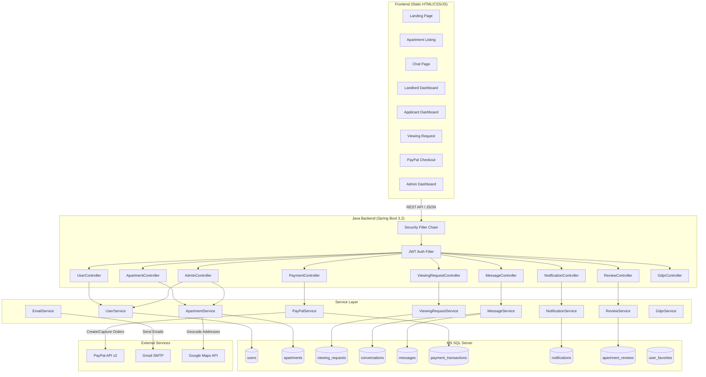

---

## 2. Entity Relationship Diagram

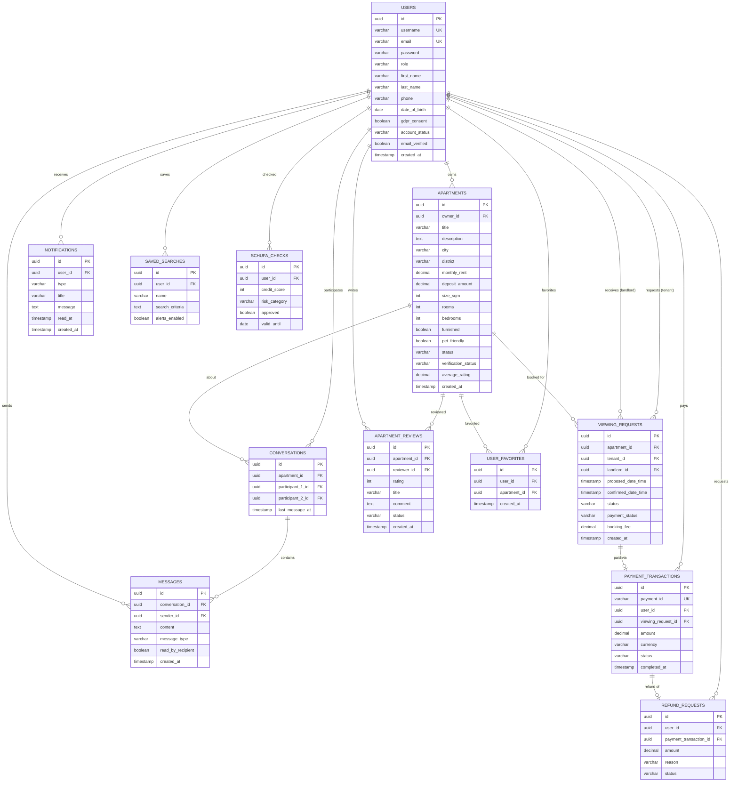

---

## 3. Authentication Flow

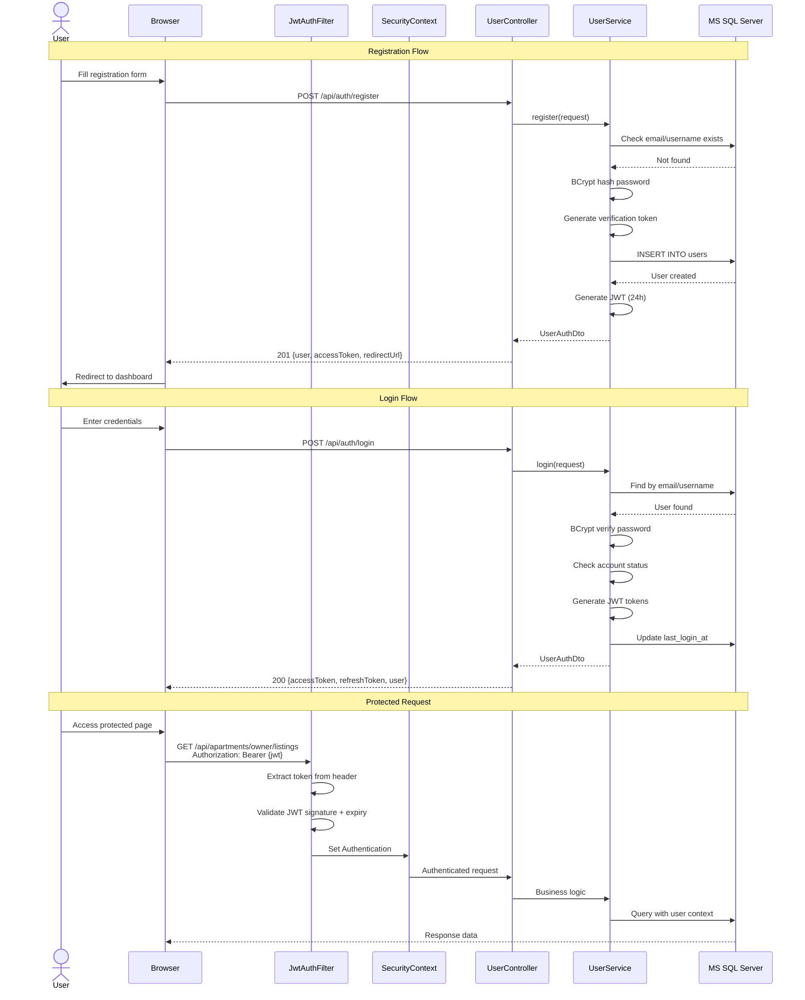

---

## 4. Viewing Request Lifecycle

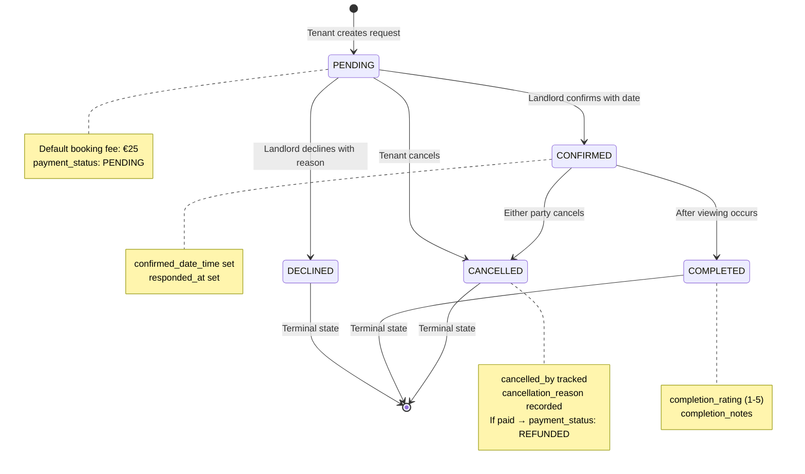

---

## 5. PayPal Payment Flow

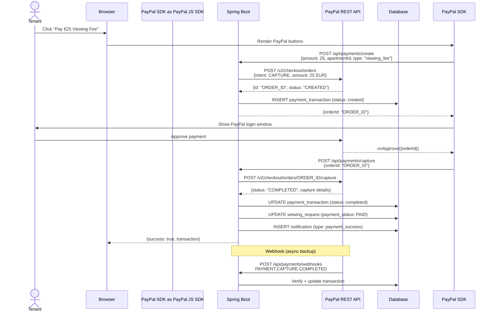

---

## 6. Review Moderation Flow

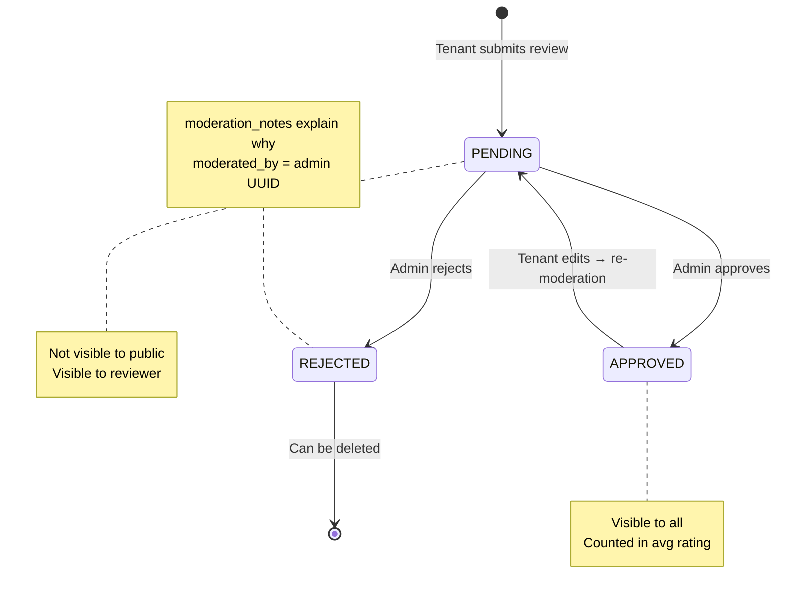

---

## 7. GDPR Data Flow

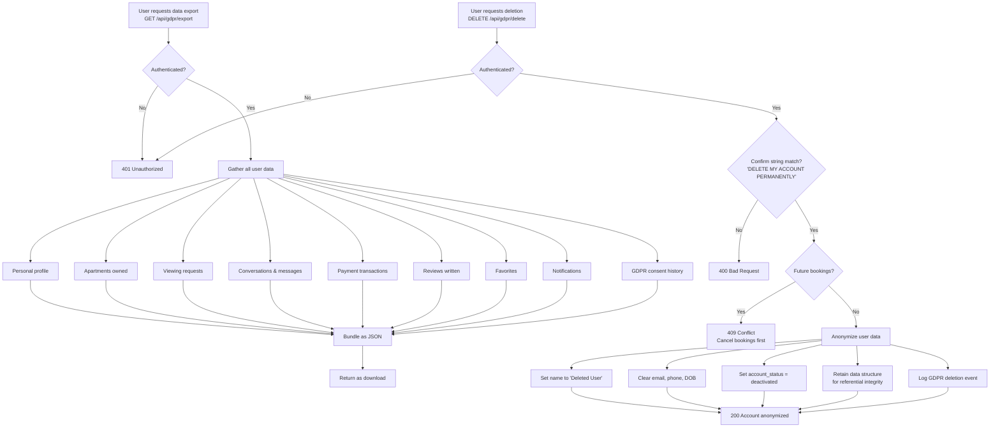

---

## 8. User Role Flow

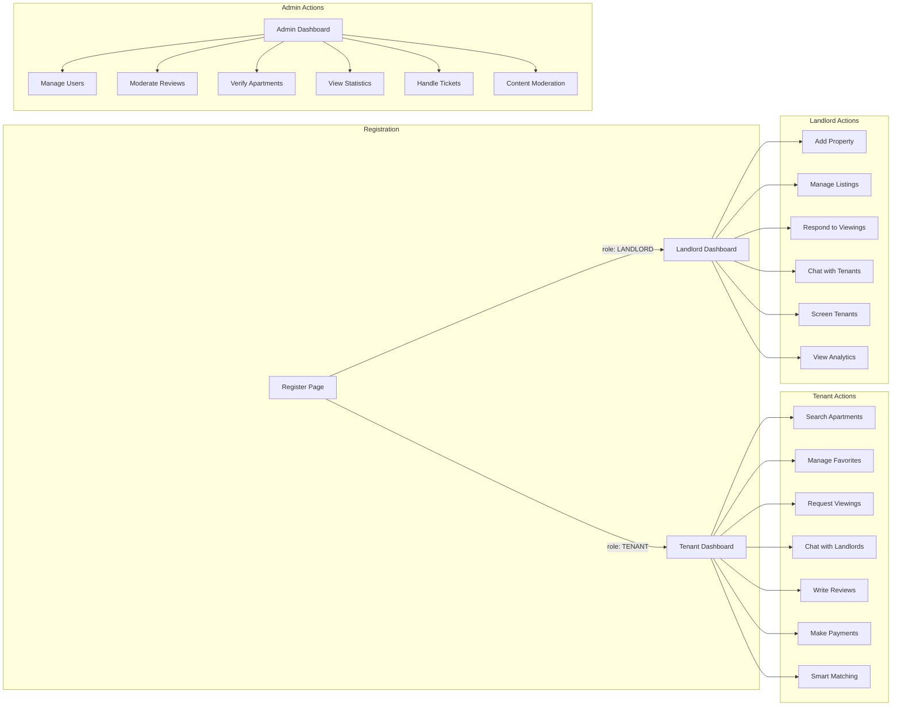

---

## 9. Apartment Listing Lifecycle

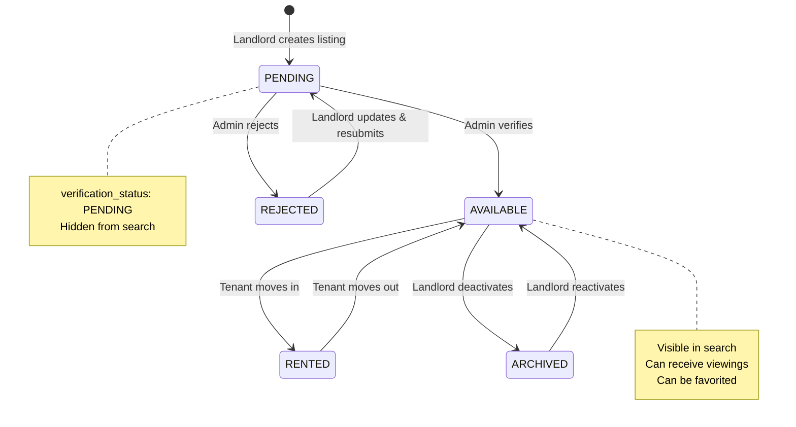

---

## 10. Chat / Messaging Architecture

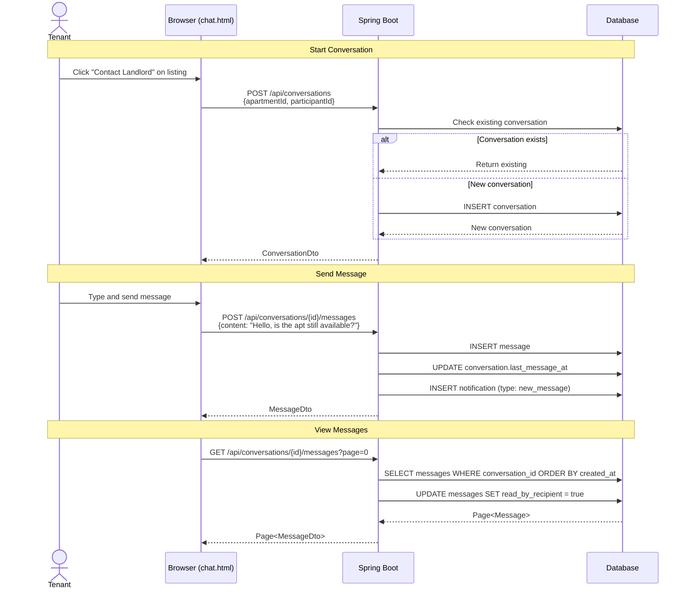

---

## 11. Advanced Search Filter Architecture

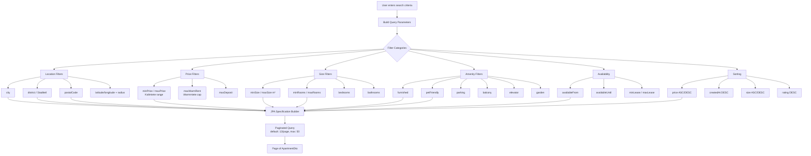

---

## 12. Deployment Pipeline

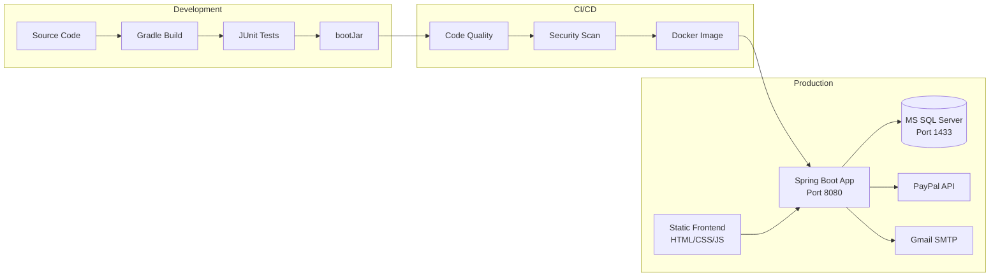

---

## 13. Data Model — Full Entity Map

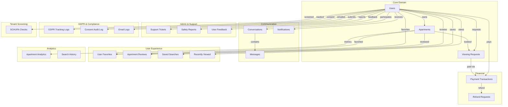

---

## 14. Frontend Page Navigation Map

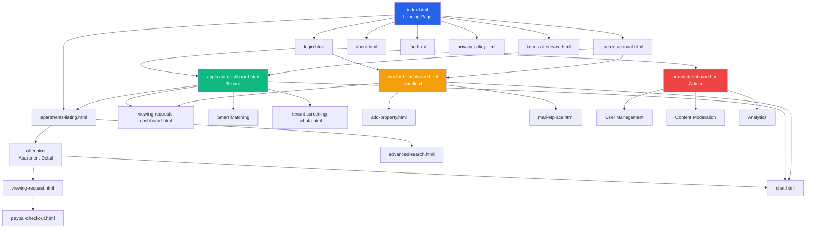

---

> **Render these diagrams** using VS Code's Mermaid Preview extension, GitHub's built-in Mermaid support, or any compatible viewer.
