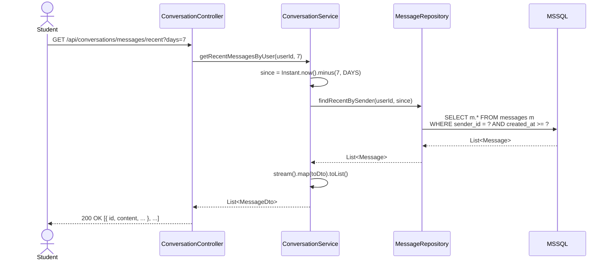

# SichrPlace — Tutorium Lab: MSSQL Workplace

> **Audience:** SE tutorium students and tutors at RWTH Aachen
> **Last updated:** February 2026
> **Prerequisites:** Java 17+, Docker Desktop (or native MSSQL), Git, curl or Postman
> **Duration:** 2–3 lab sessions (90 min each)

---

## Overview

This lab uses the **SichrPlace MSSQL workplace** — a fully seeded student-housing
platform backed by SQL Server 2025 and Spring Boot 3.2.  Every student gets an
identical local database with realistic data (users, apartments, conversations,
reviews) and a running REST API to experiment with.

### What you will learn

| Session | Topic | SE Concepts |
|---------|-------|-------------|
| **Lab 1** | Setup, login, explore the API | Spring profiles, JWT auth, REST conventions |
| **Lab 2** | Messaging, viewing requests, reviews | CRUD, state machines, role-based access |
| **Lab 3** | Extend the backend (new endpoint) | JPA queries, service layer, schema evolution |

---

## Lab 1 — Setup and First API Calls

### Step 1: Start the MSSQL database

**Option A — Docker (recommended):**

```powershell
# Clone the repo and cd into it
git clone https://github.com/omer3kale/sichrplace-backend.git
cd sichrplace-backend

# Start MSSQL 2025 Developer in Docker
docker compose -f docker-compose.local-mssql.yml up -d
```

Wait ~30 s for the container to become healthy, then verify:

```powershell
docker ps --format "table {{.Names}}\t{{.Status}}"
```

You should see `sichrplace-mssql` with status `Up ... (healthy)`.

**Option B — Native SQL Server on Windows:**

1. Install SQL Server 2022/2025 Developer Edition.
2. Open SSMS and run `db/local-mssql-init.sql`.

### Step 2: Start Spring Boot

```powershell
# Create env file (or set variables manually)
echo "LOCAL_DB_USER=sichrplace_user" > .env.local
echo "LOCAL_DB_PASS=SichrDev2025!" >> .env.local

# Load env vars into PowerShell session
Get-Content .env.local | ForEach-Object {
    if ($_ -match '^([^#=]+)=(.*)$') {
        [Environment]::SetEnvironmentVariable($matches[1].Trim(), $matches[2].Trim(), 'Process')
    }
}

# Run with local-mssql profile
./gradlew bootRun --args='--spring.profiles.active=local-mssql'
```

Watch the console output.  You should see:

```
DataSeeder: populating SichrPlace workplace seed data …
  ✓ 6 users created
  ✓ 4 apartments created
  ✓ 2 listings created
  ✓ 3 conversations created
  ✓ 12 messages created
  ✓ 3 viewing requests created
  ✓ 3 reviews created
  ✓ 5 favorites created
  ✓ 5 notifications created
═══════════════════════════════════════════════════════
  SichrPlace workplace seed complete!
  Login with any seed account: password123
═══════════════════════════════════════════════════════
Started SichrPlaceBackendApplication in ~15s
```

> **Teaching note:** The `DataSeeder` is a Spring `CommandLineRunner` annotated
> with `@Profile({"beta-mssql", "local-mssql"})`.  It only runs when the
> `users` table is empty.  Look at `config/DataSeeder.java` to see how it works.

### Step 3: Login as Charlie

```bash
curl -X POST http://localhost:8080/api/auth/login \
  -H "Content-Type: application/json" \
  -d '{"email":"charlie.student@rwth-aachen.de","password":"password123"}'
```

Copy the `accessToken` from the response — you'll need it for every subsequent request.

> **PowerShell variant:**
> ```powershell
> $body = '{"email":"charlie.student@rwth-aachen.de","password":"password123"}'
> $r = Invoke-RestMethod -Uri http://localhost:8080/api/auth/login -Method Post `
>   -ContentType "application/json" -Body $body
> $token = $r.accessToken
> echo "Token: $token"
> ```

### Step 4: Explore the API

Try these calls (replace `$TOKEN` with your access token):

```bash
# List apartments
curl http://localhost:8080/api/apartments \
  -H "Authorization: Bearer $TOKEN"

# Get apartment #1 details
curl http://localhost:8080/api/apartments/1

# Check your favorites
curl http://localhost:8080/api/favorites \
  -H "Authorization: Bearer $TOKEN"

# Get your notifications
curl http://localhost:8080/api/notifications \
  -H "Authorization: Bearer $TOKEN"
```

### Step 5: Inspect the database

Open SSMS (or Azure Data Studio) and connect to `localhost,1433` with
user `sichrplace_user` / password `SichrDev2025!`.

Run the verification query:

```sql
SELECT 'users' AS tbl, COUNT(*) AS cnt FROM users
UNION ALL SELECT 'apartments', COUNT(*) FROM apartments
UNION ALL SELECT 'listings', COUNT(*) FROM listings
UNION ALL SELECT 'conversations', COUNT(*) FROM conversations
UNION ALL SELECT 'messages', COUNT(*) FROM messages
UNION ALL SELECT 'viewing_requests', COUNT(*) FROM viewing_requests
UNION ALL SELECT 'apartment_reviews', COUNT(*) FROM apartment_reviews
UNION ALL SELECT 'user_favorites', COUNT(*) FROM user_favorites
UNION ALL SELECT 'notifications', COUNT(*) FROM notifications;
```

Expected: users=6, apartments=4, listings=2, conversations=3, messages=12,
viewing_requests=3, apartment_reviews=3, user_favorites=5, notifications=5.

---

> **SQL focus:** After completing Lab 1, try SQL_LAB_MSSQL_BASICS exercises 1–5
> ("Discover the data") — explore the same seed data you just called via REST,
> but directly in MSSQL: [`SQL_LAB_MSSQL_BASICS.md`](SQL_LAB_MSSQL_BASICS.md)

### Exercise 1.1 — Map the ERD

> **📊 Diagram:** Open the ERD — [`diagrams/erd_sichrplace.png`](diagrams/erd_sichrplace.png)
> (source: [`diagrams/erd_sichrplace.md`](diagrams/erd_sichrplace.md))

For each of these API calls, write down **which tables** are touched:

| API Call | Tables touched |
|----------|---------------|
| `POST /api/auth/login` | ? |
| `GET /api/apartments` | ? |
| `GET /api/conversations/1/messages` | ? |
| `POST /api/favorites/1` | ? |
| `GET /api/notifications/unread/count` | ? |

> **Hint:** Follow the foreign keys in the ERD.
> `messages` → `conversations` → `users`, `apartments` → `users`, etc.

<details>
<summary>Solution</summary>

| API Call | Tables touched |
|----------|---------------|
| `POST /api/auth/login` | `users` |
| `GET /api/apartments` | `apartments` (+ `users` via owner FK in DTO) |
| `GET /api/conversations/1/messages` | `messages`, `conversations`, `users` |
| `POST /api/favorites/1` | `user_favorites`, `users`, `apartments` |
| `GET /api/notifications/unread/count` | `notifications` |

</details>

---

### Exercise 1.2 — Role-based access

Login as different users and try the same endpoint.  Note the HTTP status codes.

| Action | As Charlie (TENANT) | As Alice (LANDLORD) | As Admin |
|--------|-------------------|-------------------|----------|
| `POST /api/apartments` | ? | ? | ? |
| `GET /api/viewing-requests/apartment/1` | ? | ? | ? |
| `GET /api/admin/dashboard` | ? | ? | ? |
| `POST /api/viewing-requests` | ? | ? | ? |

> **Question:** Which Spring annotation enforces these role checks?
> Where in the codebase is it applied?

<details>
<summary>Solution</summary>

| Action | Charlie (TENANT) | Alice (LANDLORD) | Admin |
|--------|-----------------|-----------------|-------|
| `POST /api/apartments` | 403 Forbidden | 201 Created | 201 Created |
| `GET /api/viewing-requests/apartment/1` | 403 Forbidden | 200 OK | 200 OK |
| `GET /api/admin/dashboard` | 403 Forbidden | 403 Forbidden | 200 OK |
| `POST /api/viewing-requests` | 201 Created | 403 Forbidden | 403 Forbidden |

The annotation is `@PreAuthorize("hasRole('...')")` on controller methods.
See `ApartmentController.java`, `ViewingRequestController.java`, `AdminController.java`.

</details>

---

> **SQL focus:** After completing Lab 1, also try SQL_LAB_MSSQL_BASICS
> exercises 6–10 ("Join the domain") — practice the JOINs that map to the
> API calls you just made: [`SQL_LAB_MSSQL_BASICS.md`](SQL_LAB_MSSQL_BASICS.md)

---

## Lab 2 — Messaging, Viewing Requests, and Reviews

### Exercise 2.1 — Complete conversation flow

**Scenario:** Diana (TENANT) wants to inquire about Bob's apartment #4 (Mitte).

1. Login as Diana (`diana.student@rwth-aachen.de` / `password123`).
2. Create a new conversation about apartment #4 with Bob:
   ```bash
   curl -X POST http://localhost:8080/api/conversations \
     -H "Content-Type: application/json" \
     -H "Authorization: Bearer $TOKEN_DIANA" \
     -d '{"participant2Id":3,"apartmentId":4}'
   ```
3. Send a message in the new conversation:
   ```bash
   curl -X POST http://localhost:8080/api/conversations/<convId>/messages \
     -H "Content-Type: application/json" \
     -H "Authorization: Bearer $TOKEN_DIANA" \
     -d '{"content":"Hallo Bob, ist die Wohnung in der Marktstraße noch frei?","messageType":"TEXT"}'
   ```
4. Login as Bob (`bob.landlord@gmail.com`), list conversations, and reply.
5. Login as Diana again, check unread count, mark conversation as read.

**Document the HTTP status codes and response bodies at each step.**

---

### Exercise 2.2 — Viewing request state machine

> **📊 Diagram:** Open the state charts — [`diagrams/state_message_lifecycle.png`](diagrams/state_message_lifecycle.png)
> (source: [`diagrams/state_charts.md`](diagrams/state_charts.md) → Section 2, Viewing Request Lifecycle)

Execute this sequence and verify the state transitions:

```
1. Login as Erik  → POST /api/viewing-requests (apartment #2)     → Status: PENDING
2. Login as Alice → GET  /api/viewing-requests/apartment/2        → See Erik's request
3. Login as Alice → PUT  /api/viewing-requests/<id>/confirm       → Status: CONFIRMED
4. Login as Erik  → GET  /api/viewing-requests/my                 → Verify CONFIRMED
5. Login as Erik  → PUT  /api/viewing-requests/<id>/cancel        → Status: CANCELLED
```

**Question:** What happens if Alice tries to confirm a request that's already CANCELLED?

> **Hint:** The service layer should return HTTP 409 Conflict.

---

### Exercise 2.3 — Review moderation cycle

1. Login as Erik → Submit a review for apartment #1 Ponttor.
2. Login as Admin → Check pending reviews (`GET /api/reviews/pending`).
3. Approve Erik's review → `POST /api/reviews/<id>/moderate`.
4. Verify it now appears in public reviews: `GET /api/reviews/apartment/1`.
5. Login as Erik → Edit the review → Verify it resets to PENDING.

**Draw the state transitions you observed between PENDING → APPROVED → (edit) → PENDING.**

---

> **SQL focus:** After completing Lab 2, try SQL_LAB_MSSQL_BASICS exercises
> 11–15 ("Aggregate the workplace") and SQL_LAB_MSSQL_INTERMEDIATE exercises
> 1–3 (normalization & constraints):
> [`SQL_LAB_MSSQL_BASICS.md`](SQL_LAB_MSSQL_BASICS.md) ·
> [`SQL_LAB_MSSQL_INTERMEDIATE.md`](SQL_LAB_MSSQL_INTERMEDIATE.md)

---

## Lab 3 — Extend the Backend

### Exercise 3.1 — Add a "messages by user in last N days" endpoint

> **📊 Diagram:** Study the sequence diagram — [`diagrams/sequence_send_message.png`](diagrams/sequence_send_message.png)
> (source: [`diagrams/sequence_diagrams.md`](diagrams/sequence_diagrams.md))
> Model your new endpoint's flow in the same style.

**Goal:** Create `GET /api/conversations/messages/recent?days=7` that returns
all messages sent by the current user in the last N days.

**Steps:**

1. **Repository** — Add a custom query to `MessageRepository.java`:
   ```java
   @Query("SELECT m FROM Message m WHERE m.sender.id = :userId " +
          "AND m.createdAt >= :since ORDER BY m.createdAt DESC")
   List<Message> findRecentBySender(@Param("userId") Long userId,
                                    @Param("since") Instant since);
   ```

2. **Service** — Add a method to `ConversationService.java`:
   ```java
   public List<MessageDto> getRecentMessagesByUser(Long userId, int days) {
       Instant since = Instant.now().minus(days, ChronoUnit.DAYS);
       return messageRepository.findRecentBySender(userId, since)
               .stream().map(this::toDto).toList();
   }
   ```

3. **Controller** — Add the endpoint to `ConversationController.java`:
   ```java
   @GetMapping("/messages/recent")
   @PreAuthorize("isAuthenticated()")
   @Operation(summary = "Get my messages from the last N days")
   public ResponseEntity<List<MessageDto>> getRecentMessages(
           @RequestParam(defaultValue = "7") int days) {
       return ResponseEntity.ok(
           conversationService.getRecentMessagesByUser(getCurrentUserId(), days));
   }
   ```

4. **Test:** Restart the app and call:
   ```bash
   curl http://localhost:8080/api/conversations/messages/recent?days=365 \
     -H "Authorization: Bearer $TOKEN_CHARLIE"
   ```

5. **Verify in SSMS:** Run the equivalent SQL query directly:
   ```sql
   SELECT m.content, m.created_at, u.email
   FROM messages m
   JOIN users u ON m.sender_id = u.id
   WHERE u.email = 'charlie.student@rwth-aachen.de'
     AND m.created_at >= DATEADD(DAY, -365, GETDATE())
   ORDER BY m.created_at DESC;
   ```

> **Teaching question:** Why does the JPQL query work identically on MSSQL and
> PostgreSQL, while the raw SQL query uses `DATEADD` (MSSQL-specific)?

---

### Exercise 3.2 — Add a new seed user group

**Goal:** Add a "student group" of 3 new users to `DataSeeder.java`.

1. Open `src/main/java/com/sichrplace/backend/config/DataSeeder.java`.
2. After the existing 6 users, add 3 more:
   ```java
   User fatima = userRepository.save(User.builder()
           .email("fatima.student@rwth-aachen.de").password(encodedPw)
           .firstName("Fatima").lastName("Yilmaz")
           .bio("MSc Data Science student, looking for apartment near Hbf.")
           .role(User.UserRole.TENANT).emailVerified(true)
           .city("Aachen").country("Germany")
           .isActive(true).gdprConsent(true)
           .gdprConsentDate(Instant.parse("2026-01-15T10:00:00Z"))
           .marketingConsent(false).build());
   // ... add 2 more students
   ```
3. Add a conversation between the new student and an existing landlord.
4. **Reset** the database and restart to verify:
   ```powershell
   docker compose -f docker-compose.local-mssql.yml down -v
   docker compose -f docker-compose.local-mssql.yml up -d
   # Wait for healthy, then
   ./gradlew bootRun --args='--spring.profiles.active=local-mssql'
   ```
5. Verify: login as Fatima, check that her conversation appears.

---

### Exercise 3.3 — Schema evolution (advanced)

> **📊 Diagram:** After adding new columns, update the ERD —
> [`diagrams/erd_sichrplace.md`](diagrams/erd_sichrplace.md)
> and the architecture flow [`diagrams/arch_request_flow.png`](diagrams/arch_request_flow.png)
> to reflect the new fields.

**Scenario:** Add a `lease_start_date` and `lease_end_date` to the `apartments` table.

1. **JPA entity** — Add fields to `Apartment.java`:
   ```java
   @Column(name = "lease_start_date")
   private LocalDate leaseStartDate;

   @Column(name = "lease_end_date")
   private LocalDate leaseEndDate;
   ```

2. **Restart** the app with `local-mssql` profile.  Hibernate `ddl-auto=update`
   will add the columns automatically.

3. **Verify in SSMS:**
   ```sql
   SELECT COLUMN_NAME, DATA_TYPE
   FROM INFORMATION_SCHEMA.COLUMNS
   WHERE TABLE_NAME = 'apartments'
     AND COLUMN_NAME LIKE 'lease%';
   ```

4. **Migration script** — Write an idempotent SQL script for reproducibility:
   ```sql
   -- db/migrations/V002__add_lease_dates.sql
   IF NOT EXISTS (
       SELECT 1 FROM INFORMATION_SCHEMA.COLUMNS
       WHERE TABLE_NAME = 'apartments' AND COLUMN_NAME = 'lease_start_date'
   )
   BEGIN
       ALTER TABLE apartments ADD lease_start_date DATE NULL;
       ALTER TABLE apartments ADD lease_end_date DATE NULL;
       PRINT 'Added lease date columns to apartments.';
   END
   ELSE
       PRINT 'Lease date columns already exist — skipping.';
   GO
   ```

5. **Update the ERD** in `docs/diagrams/erd_sichrplace.md` — add the new columns
   to the `apartments` entity block.

6. **Update the seed** in `DataSeeder.java` — set lease dates on the seeded apartments.

> **Teaching question:** Why do we write an idempotent migration script even
> though Hibernate handles the column addition?  What happens if someone
> applied the migration manually before running the updated code?

---

## Diagram Cross-References

Use these diagrams throughout the lab to connect API behavior with the data model:

| Diagram | File | Use in lab |
|---------|------|-----------|
| **ERD** | [`erd_sichrplace.md`](diagrams/erd_sichrplace.md) | Exercise 1.1 — identify tables per API call |
| **State charts** | [`state_charts.md`](diagrams/state_charts.md) | Exercise 2.2 — verify viewing request transitions |
| **Sequence diagrams** | [`sequence_diagrams.md`](diagrams/sequence_diagrams.md) | Exercise 3.1 — model your new endpoint |
| **Architecture flow** | [`architecture_flow.md`](diagrams/architecture_flow.md) | Understand HTTP → Controller → Service → JPA → MSSQL |

### Extending the diagrams

When you add a new endpoint (Exercise 3.1), draw its sequence diagram:



---

## Comparing Local and Beta (Droplet)

Your local environment and the shared beta on the droplet are **identical** in:

| Aspect | Local (`local-mssql`) | Beta (`beta-mssql`) |
|--------|----------------------|---------------------|
| **MSSQL version** | 2025 Developer (Docker) | 2025 Developer (Docker) |
| **Database name** | `sichrplace` | `sichrplace` |
| **Schema** | Created by Hibernate `ddl-auto=update` | Same JPA entities |
| **Seed data** | `DataSeeder.java` auto-seeds on empty DB | Same `DataSeeder.java` |
| **Tables** | 11 tables, same columns | 11 tables, same columns |
| **Seed counts** | 6 users, 4 apartments, … (43 rows total) | 6 users, 4 apartments, … (43 rows total) |
| **Auth** | JWT (same algorithm, different secret) | JWT (same algorithm, different secret) |
| **API endpoints** | 61 endpoints | 61 endpoints |

**Differences (expected):**
- **JDBC URL:** `localhost:1433` vs `database:1433` (container networking)
- **Credentials:** Dev defaults vs `.env` secrets on droplet
- **JWT secret:** Dev placeholder vs production-grade random key
- **TLS:** None locally vs automatic HTTPS via Caddy on droplet

> **Reflection:** Why do we keep the same Spring Boot JAR for both environments
> and only change the profile?  How does this simplify CI/CD?

---

## Reset Instructions

### Full reset (wipe database and re-seed)

```powershell
# Option 1: Docker volume reset
docker compose -f docker-compose.local-mssql.yml down -v
docker compose -f docker-compose.local-mssql.yml up -d
# Restart Spring Boot — DataSeeder will re-seed

# Option 2: SQL truncation (keeps container running)
# Connect to MSSQL and run:
DELETE FROM notifications;
DELETE FROM user_favorites;
DELETE FROM apartment_reviews;
DELETE FROM messages;
DELETE FROM viewing_requests;
DELETE FROM conversations;
DELETE FROM listings;
DELETE FROM apartments;
DELETE FROM users;
# Restart Spring Boot — DataSeeder will re-seed
```

---

> **SQL focus:** After completing Lab 3, try SQL_LAB_MSSQL_INTERMEDIATE
> exercises 4–8 (indexing, parameterised queries, CTEs) and the MSSQL
> features showcase (views, `OFFSET-FETCH`, `DATEADD`):
> [`SQL_LAB_MSSQL_INTERMEDIATE.md`](SQL_LAB_MSSQL_INTERMEDIATE.md) ·
> [`SQL_MSSQL_FEATURES_SHOWCASE.md`](SQL_MSSQL_FEATURES_SHOWCASE.md)
>
> **Exam practice:** [`SQL_EXAM_QUESTIONS.md`](SQL_EXAM_QUESTIONS.md)
> — 3 exam-style questions on the SichrPlace schema.

---

## Quality & Security Tour (15 minutes)

> **Goal:** Walk through the project's quality gates end-to-end so every
> student understands what the CI pipeline enforces before code ships.

### Station 1 — Test suite & JaCoCo report (5 min)

1. Run the test suite with coverage collection:
   ```powershell
   ./gradlew testWithCoverage
   ```
2. Open the HTML report in a browser:
   ```
   build/reports/jacoco/test/html/index.html
   ```
3. Click into the **service** package.  Notice which classes have red
   (uncovered) lines vs. green (covered) lines.
4. Note the **overall instruction coverage** shown at the top of the report.

### Station 2 — COCO rules & the two-tier model (5 min)

1. Open [`docs/coco_rules.yml`](coco_rules.yml) in your editor.
   - **target** = enforceable right now (CI gate — build fails below this).
   - **aspiration** = where we want to be once the full test suite is written.
2. Run the COCO check:
   ```powershell
   ./gradlew checkCoco
   ```
3. Read the output table.  Each package shows:
   ```
   <package>  actual% / target%  ✔ PASS  or  ✘ FAIL
   ```
4. Open [`docs/COCO_RULES.md`](COCO_RULES.md) §5 to learn the **ratchet-up**
   process: when you push coverage above the target, raise the target to
   `actual − 5 %` so it never regresses.

### Station 3 — Secrets scanning (3 min)

1. Run the secrets scanner:
   ```powershell
   ./gradlew secretsCheck
   ```
2. It should pass.  Now create a fake leak to see what happens:
   ```powershell
   echo "password: RealSecret123!" > src/main/resources/fake-leak.yml
   ./gradlew secretsCheck     # should FAIL
   Remove-Item src/main/resources/fake-leak.yml
   ```
3. Open [`docs/SECURITY_AND_SECRETS.md`](SECURITY_AND_SECRETS.md) §8 to see
   the list of **teaching-only fake credentials** (e.g. `password123`,
   `changeme`).  These are safe — real deployments must use env vars.

### Station 4 — Pick a package & improve (2 min)

1. Look at the COCO output table.  Choose a package whose **actual** is close
   to its **target** (or below its **aspiration**).
2. Brainstorm one test class you could add for that package.
3. *(Optional homework)* Write the test, re-run `testWithCoverage`, and
   ratchet the target up following the process in COCO_RULES §5.

> **Takeaway:** Every PR must pass `testWithCoverage`, `checkCoco`, and
> `secretsCheck` before merge.  See [`CONTRIBUTING_QUALITY.md`](CONTRIBUTING_QUALITY.md)
> for the full PR checklist.

---

## Bonus Exercises — Quality & Security

> These exercises can be done in any lab session.  They reinforce the
> project's quality gates: code coverage and secrets scanning.

---

## Bonus Exercises — Showcase Features (v1.2.0)

> These exercises explore the three showcase features added in v1.2.0.
> They demonstrate advanced patterns: JPA Specifications, secure token
> lifecycle, and aggregate statistics.

### Exercise S.1 — Execute a saved search

1. Login as Charlie (TENANT) and create a saved search:
   ```bash
   curl -X POST http://localhost:8080/api/saved-searches \
     -H "Content-Type: application/json" \
     -H "Authorization: Bearer $TOKEN" \
     -d '{"name":"Aachen Budget","filterJson":"{\"city\":\"Aachen\",\"maxPrice\":500}"}'
   ```
2. Execute the saved search (note the ID from step 1):
   ```bash
   curl -X POST http://localhost:8080/api/saved-searches/1/execute?page=0&size=20 \
     -H "Authorization: Bearer $TOKEN"
   ```
3. **Answer:** How many apartments match? Which fields from
   `SearchFilterDto` were used to build the query?
4. Modify the `filterJson` to add `"furnished":true`. Create a new saved
   search and execute it. Does the result set change?
5. Open `ApartmentSpecifications.java` and trace how each filter field
   becomes a JPA `Predicate`. Why is `status=AVAILABLE` always added?

<details>
<summary>Hints</summary>

- `SearchFilterDto` fields that are `null` are ignored — this gives composable filters.
- The `Specification<Apartment>` builds AND-predicates dynamically at runtime.
- This pattern avoids N+1 query methods in the repository.

</details>

### Exercise S.2 — Password reset lifecycle

1. Request a password reset for Charlie:
   ```bash
   curl -X POST http://localhost:8080/api/auth/forgot-password \
     -H "Content-Type: application/json" \
     -d '{"email":"charlie.student@rwth-aachen.de"}'
   ```
2. Copy the `token` from the response.
3. Reset Charlie's password:
   ```bash
   curl -X POST http://localhost:8080/api/auth/reset-password \
     -H "Content-Type: application/json" \
     -d '{"token":"<paste token>","newPassword":"newSecureP@ss1"}'
   ```
4. **Verify:** Login with the new password:
   ```bash
   curl -X POST http://localhost:8080/api/auth/login \
     -H "Content-Type: application/json" \
     -d '{"email":"charlie.student@rwth-aachen.de","password":"newSecureP@ss1"}'
   ```
5. **Security question:** Try using the same token again. What happens? Why?
6. Try requesting a reset for a non-existent email. Does the API reveal
   whether the email exists?

<details>
<summary>Hints</summary>

- Tokens are stored as SHA-256 hashes — the plaintext is shown only once.
- Tokens are single-use (`usedAt` is set after first use) and expire after 1 hour.
- The `forgotPassword` endpoint always returns the same success message to
  prevent email enumeration attacks.

</details>

### Exercise S.3 — Viewing request statistics and completion

1. Login as Diana (TENANT) and check her viewing request statistics:
   ```bash
   curl http://localhost:8080/api/viewing-requests/statistics \
     -H "Authorization: Bearer $TOKEN_DIANA"
   ```
2. Login as Bob (LANDLORD) and check his statistics. How do the
   counts differ? Why?
3. Create a new viewing request as Diana, have Bob confirm it, then
   complete it:
   ```bash
   # As Diana: create
   curl -X POST http://localhost:8080/api/viewing-requests ...
   # As Bob: confirm
   curl -X PUT http://localhost:8080/api/viewing-requests/{id}/confirm ...
   # As Diana or Bob: complete
   curl -X PUT http://localhost:8080/api/viewing-requests/{id}/complete ...
   ```
4. Re-check the statistics. Did `completedCount` increment?
5. **State machine question:** What happens if you try to complete a
   PENDING request? What about a DECLINED one?

<details>
<summary>Hints</summary>

- Only CONFIRMED requests can be completed — the service enforces valid
  state transitions.
- Landlords see stats for requests against their apartments; tenants see
  stats for requests they created.
- The `averageResponseTimeHours` is computed from `ViewingRequestTransition`
  records (PENDING → CONFIRMED/DECLINED).

</details>

---

### Exercise B.1 — Run tests with coverage

1. Run the full test suite with JaCoCo coverage:
   ```powershell
   ./gradlew testWithCoverage
   ```
2. Open the HTML report: `build/reports/jacoco/test/html/index.html`
3. **Answer:** What is the current overall instruction coverage percentage?
4. Run the per-package COCO check:
   ```powershell
   ./gradlew checkCoco
   ```
5. Which packages (if any) are below their target?  Look at the output table.
6. Open [`docs/COCO_RULES.md`](COCO_RULES.md) and find the target for the
   `service` package.  Why is it set higher than `config`?

<details>
<summary>Hints</summary>

- The `service` package contains business logic — bugs here have the highest
  impact, so the coverage target (95%) is the strictest.
- The `config` package mostly contains Spring configuration beans that are
  difficult to unit-test in isolation, so 60% is acceptable.
- Coverage reports live under `build/reports/jacoco/test/`.

</details>

---

### Exercise B.2 — Secrets scanning

1. Run the secrets scanner:
   ```powershell
   ./gradlew secretsCheck
   ```
2. Does it pass?  If not, read the output to find which files contain
   hardcoded secrets.
3. Open `src/main/resources/application-local.yml`.  Notice the `${...}`
   placeholders.  Explain how Spring resolves `${LOCAL_DB_PASS:changeme}`.
4. Create a temporary file `src/main/resources/test-leak.yml` with:
   ```yaml
   secret: MyRealPassword123!
   ```
5. Run `./gradlew secretsCheck` again.  Does it fail?  Why?
6. Delete `test-leak.yml` and verify the check passes again.

> **Teaching question:** Why do we run `secretsCheck` in CI before building
> the Docker image?  What could happen if a real JWT secret were pushed?

---

## Summary Checklist

After completing all three labs, you should be able to:

- [ ] Start MSSQL and Spring Boot locally with the `local-mssql` profile
- [ ] Login as any seed user and obtain a JWT
- [ ] Explain which tables each API endpoint touches (using the ERD)
- [ ] Execute a complete viewing-request lifecycle (PENDING → CONFIRMED → COMPLETED)
- [ ] Submit, moderate, and verify a review
- [ ] Add a new JPA query method and map it to a REST endpoint
- [ ] Add new columns to an entity and write an idempotent migration script
- [ ] Compare your local schema with the droplet beta (should be identical)
- [ ] Draw a sequence diagram for a new endpoint
- [ ] Run `testWithCoverage` and read the JaCoCo HTML report
- [ ] Run `checkCoco` and interpret the per-package results
- [ ] Run `secretsCheck` and verify no hardcoded secrets exist
- [ ] Execute a saved search and explain how JPA Specifications work
- [ ] Request a password reset and trace the token lifecycle
