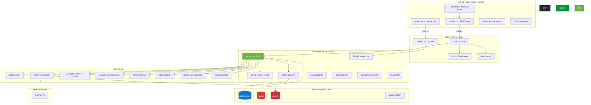

# New Self-Hosted Architecture (AFTER Migration)

```mermaid
graph TB
    subgraph "GitHub Pages - Static Frontend"
        style GHP fill:#24292e,color:white
        UI2[index.html + 43 HTML Pages]
        API_CLIENT[api-client.js - REST Client]
        STOMP_CLIENT[stomp-chat.js - WebSocket]
        PWA2[PWA + Service Worker]
        CSS2[CSS Stylesheets]
    end

    subgraph "Nginx Reverse Proxy"
        style NGINX fill:#009639,color:white
        NGX[Nginx :443/:80]
        SSL[TLS 1.3 Termination]
        RL[Rate Limiting]
        WS_UP[WebSocket Upgrade]
    end

    subgraph "Spring Boot Backend :8080"
        style SB fill:#6DB33F,color:white
        BOOT[Spring Boot 3.4.2]
        SEC[Spring Security + JWT]
        JPA[Spring Data JPA]
        WEBSOCK[STOMP WebSocket]
        MAIL[Spring Mail]
        VALID[Bean Validation]
        SCHED[Task Scheduler]
        SWAGGER[SpringDoc OpenAPI]
    end

    subgraph "Controllers"
        C_AUTH[AuthController]
        C_APT[ApartmentController]
        C_MSG[MessageController + STOMP]
        C_VR[ViewingRequestController]
        C_ADMIN[AdminController]
        C_GDPR[GdprController]
        C_USER[UserFeaturesController]
        C_HEALTH[HealthController]
    end

    subgraph "Self-Hosted Data Layer"
        MSSQL[(MSSQL 2022)]
        REDIS2[(Redis 7)]
        MINIO[(MinIO S3)]
        MAILHOG[MailHog SMTP]
    end

    subgraph "External Services"
        PAYPAL2[PayPal API]
    end

    UI2 --> API_CLIENT
    STOMP_CLIENT -->|SockJS| WS_UP
    API_CLIENT -->|HTTPS| NGX
    NGX --> SSL
    NGX --> RL
    NGX --> BOOT
    WS_UP --> WEBSOCK
    BOOT --> SEC
    BOOT --> JPA
    BOOT --> C_AUTH & C_APT & C_MSG & C_VR
    BOOT --> C_ADMIN & C_GDPR & C_USER & C_HEALTH
    JPA --> MSSQL
    BOOT --> REDIS2
    C_APT --> MINIO
    MAIL --> MAILHOG
    C_APT --> PAYPAL2

    style MSSQL fill:#0078D4,color:white
    style REDIS2 fill:#DC382D,color:white
    style MINIO fill:#C72C48,color:white
    style BOOT fill:#6DB33F,color:white
```

> Everything runs on your own infrastructure. Zero third-party cloud dependencies.
