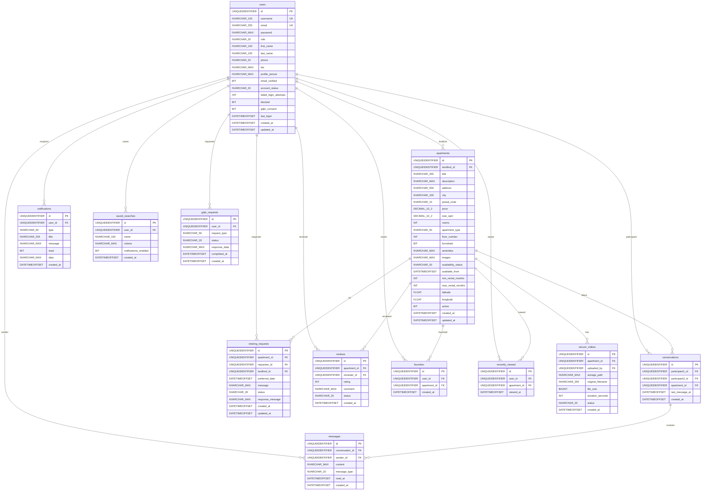

# MSSQL Database Schema (ER Diagram)

```mermaid
erDiagram
    users {
        UNIQUEIDENTIFIER id PK
        NVARCHAR_100 username UK
        NVARCHAR_255 email UK
        NVARCHAR_MAX password
        NVARCHAR_20 role
        NVARCHAR_100 first_name
        NVARCHAR_100 last_name
        NVARCHAR_20 phone
        NVARCHAR_MAX bio
        NVARCHAR_MAX profile_picture
        BIT email_verified
        NVARCHAR_20 account_status
        INT failed_login_attempts
        BIT blocked
        BIT gdpr_consent
        DATETIMEOFFSET last_login
        DATETIMEOFFSET created_at
        DATETIMEOFFSET updated_at
    }

    apartments {
        UNIQUEIDENTIFIER id PK
        UNIQUEIDENTIFIER landlord_id FK
        NVARCHAR_255 title
        NVARCHAR_MAX description
        NVARCHAR_500 address
        NVARCHAR_100 city
        NVARCHAR_10 postal_code
        DECIMAL_10_2 price
        DECIMAL_10_2 size_sqm
        INT rooms
        NVARCHAR_50 apartment_type
        INT floor_number
        BIT furnished
        NVARCHAR_MAX amenities
        NVARCHAR_MAX images
        NVARCHAR_50 availability_status
        DATETIMEOFFSET available_from
        INT min_rental_months
        INT max_rental_months
        FLOAT latitude
        FLOAT longitude
        BIT active
        DATETIMEOFFSET created_at
        DATETIMEOFFSET updated_at
    }

    conversations {
        UNIQUEIDENTIFIER id PK
        UNIQUEIDENTIFIER participant1_id FK
        UNIQUEIDENTIFIER participant2_id FK
        UNIQUEIDENTIFIER apartment_id FK
        DATETIMEOFFSET last_message_at
        DATETIMEOFFSET created_at
    }

    messages {
        UNIQUEIDENTIFIER id PK
        UNIQUEIDENTIFIER conversation_id FK
        UNIQUEIDENTIFIER sender_id FK
        NVARCHAR_MAX content
        NVARCHAR_20 message_type
        DATETIMEOFFSET read_at
        DATETIMEOFFSET created_at
    }

    viewing_requests {
        UNIQUEIDENTIFIER id PK
        UNIQUEIDENTIFIER apartment_id FK
        UNIQUEIDENTIFIER requester_id FK
        UNIQUEIDENTIFIER landlord_id FK
        DATETIMEOFFSET preferred_date
        NVARCHAR_MAX message
        NVARCHAR_20 status
        NVARCHAR_MAX response_message
        DATETIMEOFFSET created_at
        DATETIMEOFFSET updated_at
    }

    notifications {
        UNIQUEIDENTIFIER id PK
        UNIQUEIDENTIFIER user_id FK
        NVARCHAR_50 type
        NVARCHAR_255 title
        NVARCHAR_MAX message
        BIT read
        NVARCHAR_MAX data
        DATETIMEOFFSET created_at
    }

    reviews {
        UNIQUEIDENTIFIER id PK
        UNIQUEIDENTIFIER apartment_id FK
        UNIQUEIDENTIFIER reviewer_id FK
        INT rating
        NVARCHAR_MAX comment
        NVARCHAR_20 status
        DATETIMEOFFSET created_at
    }

    saved_searches {
        UNIQUEIDENTIFIER id PK
        UNIQUEIDENTIFIER user_id FK
        NVARCHAR_100 name
        NVARCHAR_MAX criteria
        BIT notifications_enabled
        DATETIMEOFFSET created_at
    }

    favorites {
        UNIQUEIDENTIFIER id PK
        UNIQUEIDENTIFIER user_id FK
        UNIQUEIDENTIFIER apartment_id FK
        DATETIMEOFFSET created_at
    }

    recently_viewed {
        UNIQUEIDENTIFIER id PK
        UNIQUEIDENTIFIER user_id FK
        UNIQUEIDENTIFIER apartment_id FK
        DATETIMEOFFSET viewed_at
    }

    gdpr_requests {
        UNIQUEIDENTIFIER id PK
        UNIQUEIDENTIFIER user_id FK
        NVARCHAR_50 request_type
        NVARCHAR_20 status
        NVARCHAR_MAX response_data
        DATETIMEOFFSET completed_at
        DATETIMEOFFSET created_at
    }

    secure_videos {
        UNIQUEIDENTIFIER id PK
        UNIQUEIDENTIFIER apartment_id FK
        UNIQUEIDENTIFIER uploaded_by FK
        NVARCHAR_MAX storage_path
        NVARCHAR_255 original_filename
        BIGINT file_size
        INT duration_seconds
        NVARCHAR_20 status
        DATETIMEOFFSET created_at
    }

    users ||--o{ apartments : "landlord"
    users ||--o{ conversations : "participant"
    users ||--o{ messages : "sender"
    users ||--o{ viewing_requests : "requester"
    users ||--o{ notifications : "recipient"
    users ||--o{ reviews : "reviewer"
    users ||--o{ saved_searches : "owner"
    users ||--o{ favorites : "owner"
    users ||--o{ recently_viewed : "viewer"
    users ||--o{ gdpr_requests : "requester"
    apartments ||--o{ conversations : "about"
    apartments ||--o{ viewing_requests : "for"
    apartments ||--o{ reviews : "reviewed"
    apartments ||--o{ favorites : "favorited"
    apartments ||--o{ recently_viewed : "viewed"
    apartments ||--o{ secure_videos : "has"
    conversations ||--o{ messages : "contains"
```

> 12 tables, 30+ indexes, 5 auto-update triggers, seed data for admin and test user.
