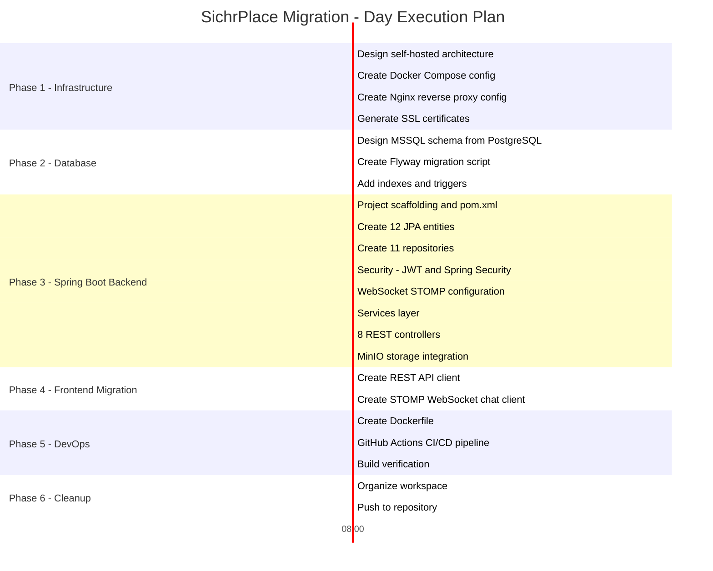

# Migration Day Execution Plan

```mermaid
gantt
    title SichrPlace Migration - Day Execution Plan
    dateFormat HH:mm
    axisFormat %H:%M

    section Phase 1 - Infrastructure
    Design self-hosted architecture     :done, p1a, 08:00, 30min
    Create Docker Compose config        :done, p1b, after p1a, 30min
    Create Nginx reverse proxy config   :done, p1c, after p1b, 20min
    Generate SSL certificates           :done, p1d, after p1c, 10min

    section Phase 2 - Database
    Design MSSQL schema from PostgreSQL :done, p2a, after p1d, 45min
    Create Flyway migration script      :done, p2b, after p2a, 30min
    Add indexes and triggers            :done, p2c, after p2b, 15min

    section Phase 3 - Spring Boot Backend
    Project scaffolding and pom.xml     :done, p3a, after p2c, 15min
    Create 12 JPA entities              :done, p3b, after p3a, 45min
    Create 11 repositories              :done, p3c, after p3b, 20min
    Security - JWT and Spring Security  :done, p3d, after p3c, 30min
    WebSocket STOMP configuration       :done, p3e, after p3d, 15min
    Services layer                      :done, p3f, after p3e, 30min
    8 REST controllers                  :done, p3g, after p3f, 45min
    MinIO storage integration           :done, p3h, after p3g, 15min

    section Phase 4 - Frontend Migration
    Create REST API client              :done, p4a, after p3h, 30min
    Create STOMP WebSocket chat client  :done, p4b, after p4a, 30min

    section Phase 5 - DevOps
    Create Dockerfile                   :done, p5a, after p4b, 15min
    GitHub Actions CI/CD pipeline       :done, p5b, after p5a, 20min
    Build verification                  :done, p5c, after p5b, 15min

    section Phase 6 - Cleanup
    Organize workspace                  :done, p6a, after p5c, 20min
    Push to repository                  :done, p6b, after p6a, 10min
```

> Total estimated time: ~8.5 hours. All phases completed.
