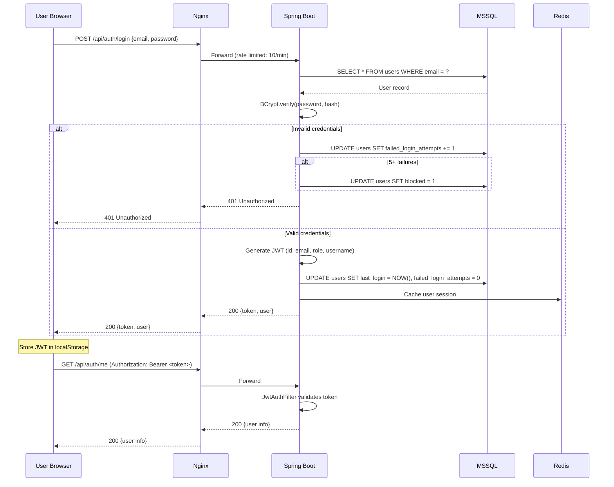
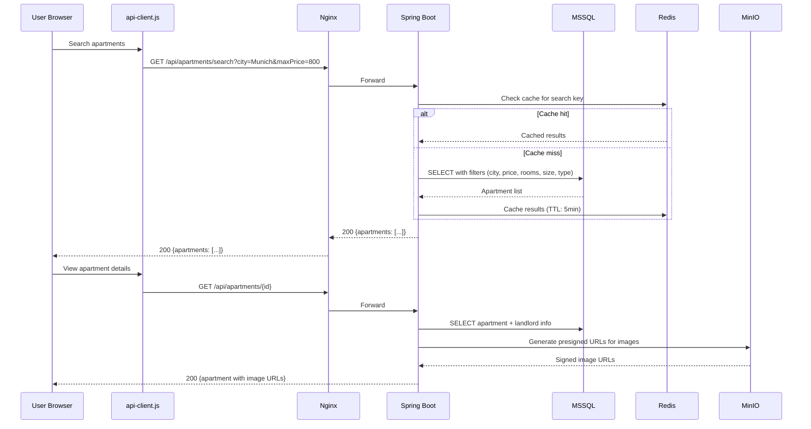
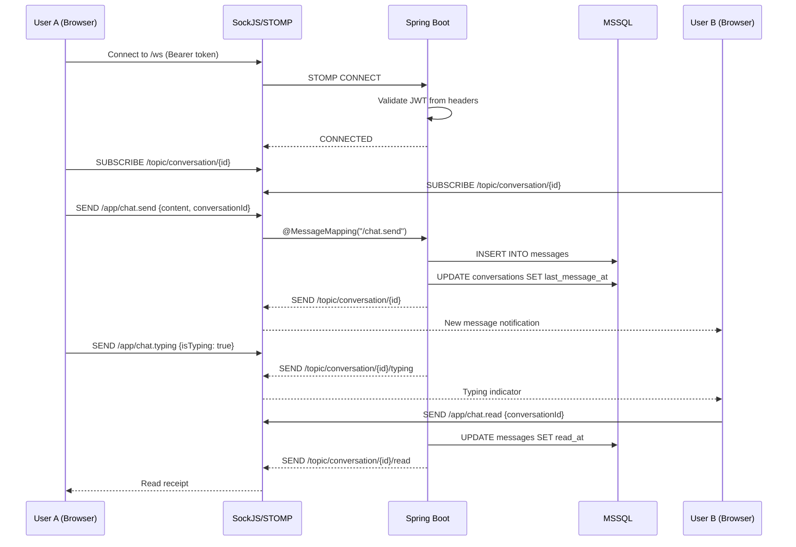
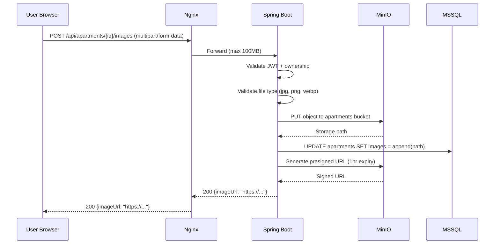
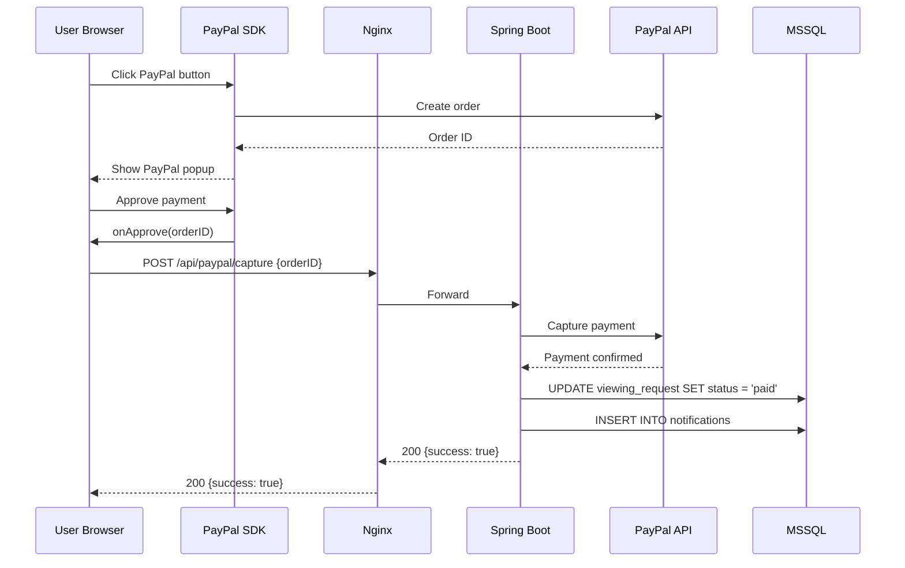

# Core API Sequence Flows

## Authentication Flow

```mermaid
sequenceDiagram
    participant U as User Browser
    participant N as Nginx
    participant S as Spring Boot
    participant DB as MSSQL
    participant R as Redis

    U->>N: POST /api/auth/login {email, password}
    N->>S: Forward (rate limited: 10/min)
    S->>DB: SELECT * FROM users WHERE email = ?
    DB-->>S: User record
    S->>S: BCrypt.verify(password, hash)

    alt Invalid credentials
        S->>DB: UPDATE users SET failed_login_attempts += 1
        alt 5+ failures
            S->>DB: UPDATE users SET blocked = 1
        end
        S-->>N: 401 Unauthorized
        N-->>U: 401 Unauthorized
    else Valid credentials
        S->>S: Generate JWT (id, email, role, username)
        S->>DB: UPDATE users SET last_login = NOW(), failed_login_attempts = 0
        S->>R: Cache user session
        S-->>N: 200 {token, user}
        N-->>U: 200 {token, user}
    end

    Note over U: Store JWT in localStorage
    U->>N: GET /api/auth/me (Authorization: Bearer <token>)
    N->>S: Forward
    S->>S: JwtAuthFilter validates token
    S-->>N: 200 {user info}
    N-->>U: 200 {user info}
```

## Apartment Search Flow

```mermaid
sequenceDiagram
    participant U as User Browser
    participant API as api-client.js
    participant N as Nginx
    participant S as Spring Boot
    participant DB as MSSQL
    participant R as Redis
    participant M as MinIO

    U->>API: Search apartments
    API->>N: GET /api/apartments/search?city=Munich&maxPrice=800
    N->>S: Forward
    S->>R: Check cache for search key
    alt Cache hit
        R-->>S: Cached results
    else Cache miss
        S->>DB: SELECT with filters (city, price, rooms, size, type)
        DB-->>S: Apartment list
        S->>R: Cache results (TTL: 5min)
    end
    S-->>N: 200 {apartments: [...]}
    N-->>U: 200 {apartments: [...]}

    U->>API: View apartment details
    API->>N: GET /api/apartments/{id}
    N->>S: Forward
    S->>DB: SELECT apartment + landlord info
    S->>M: Generate presigned URLs for images
    M-->>S: Signed image URLs
    S-->>U: 200 {apartment with image URLs}
```

## Real-time Chat Flow (STOMP/WebSocket)

```mermaid
sequenceDiagram
    participant U1 as User A (Browser)
    participant WS as SockJS/STOMP
    participant S as Spring Boot
    participant DB as MSSQL
    participant U2 as User B (Browser)

    U1->>WS: Connect to /ws (Bearer token)
    WS->>S: STOMP CONNECT
    S->>S: Validate JWT from headers
    S-->>WS: CONNECTED

    U1->>WS: SUBSCRIBE /topic/conversation/{id}
    U2->>WS: SUBSCRIBE /topic/conversation/{id}

    U1->>WS: SEND /app/chat.send {content, conversationId}
    WS->>S: @MessageMapping("/chat.send")
    S->>DB: INSERT INTO messages
    S->>DB: UPDATE conversations SET last_message_at
    S-->>WS: SEND /topic/conversation/{id}
    WS-->>U2: New message notification

    U1->>WS: SEND /app/chat.typing {isTyping: true}
    S-->>WS: SEND /topic/conversation/{id}/typing
    WS-->>U2: Typing indicator

    U2->>WS: SEND /app/chat.read {conversationId}
    S->>DB: UPDATE messages SET read_at
    S-->>WS: SEND /topic/conversation/{id}/read
    WS-->>U1: Read receipt
```

## Image Upload Flow

```mermaid
sequenceDiagram
    participant U as User Browser
    participant N as Nginx
    participant S as Spring Boot
    participant M as MinIO
    participant DB as MSSQL

    U->>N: POST /api/apartments/{id}/images (multipart/form-data)
    N->>S: Forward (max 100MB)
    S->>S: Validate JWT + ownership
    S->>S: Validate file type (jpg, png, webp)
    S->>M: PUT object to apartments bucket
    M-->>S: Storage path
    S->>DB: UPDATE apartments SET images = append(path)
    S->>M: Generate presigned URL (1hr expiry)
    M-->>S: Signed URL
    S-->>N: 200 {imageUrl: "https://..."}
    N-->>U: 200 {imageUrl: "https://..."}
```

## Payment Flow

```mermaid
sequenceDiagram
    participant U as User Browser
    participant PP as PayPal SDK
    participant N as Nginx
    participant S as Spring Boot
    participant PAY as PayPal API
    participant DB as MSSQL

    U->>PP: Click PayPal button
    PP->>PAY: Create order
    PAY-->>PP: Order ID
    PP-->>U: Show PayPal popup
    U->>PP: Approve payment
    PP->>U: onApprove(orderID)
    U->>N: POST /api/paypal/capture {orderID}
    N->>S: Forward
    S->>PAY: Capture payment
    PAY-->>S: Payment confirmed
    S->>DB: UPDATE viewing_request SET status = 'paid'
    S->>DB: INSERT INTO notifications
    S-->>N: 200 {success: true}
    N-->>U: 200 {success: true}
```
