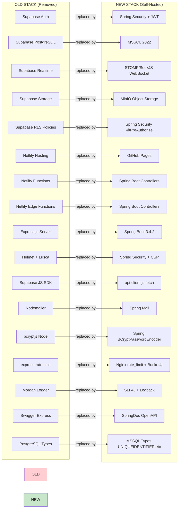

# Component-by-Component Migration Map

## Data Type Migration

| PostgreSQL (Supabase) | MSSQL 2022 |
|----------------------|------------|
| `UUID` / `gen_random_uuid()` | `UNIQUEIDENTIFIER` / `NEWID()` |
| `TEXT` | `NVARCHAR(MAX)` |
| `TIMESTAMP WITH TIME ZONE` | `DATETIMEOFFSET` |
| `BOOLEAN` | `BIT` |
| `JSONB` | `NVARCHAR(MAX)` |
| `SERIAL` | `IDENTITY(1,1)` |
| `VARCHAR(n)` | `NVARCHAR(n)` |
| `DECIMAL(10,2)` | `DECIMAL(10,2)` |
| `DOUBLE PRECISION` | `FLOAT` |
| `BIGINT` | `BIGINT` |
