# Docker Deployment Topology

```mermaid
graph TB
    subgraph "Host Machine"
        subgraph "Docker Network: sichrplace-net (172.28.0.0/16)"

            subgraph "Reverse Proxy"
                NGINX[🌐 Nginx<br/>:80 → :443<br/>SSL Termination<br/>Rate Limiting<br/>WebSocket Upgrade]
            end

            subgraph "Application"
                SPRING[🟢 Spring Boot<br/>:8080<br/>REST API<br/>STOMP WebSocket<br/>JWT Auth]
            end

            subgraph "Data Stores"
                MSSQL[🔵 MSSQL 2022<br/>:1433<br/>12 Tables<br/>2GB Memory Limit]
                REDIS[🔴 Redis 7 Alpine<br/>:6379<br/>256MB Max<br/>AOF Persistence]
                MINIO[🟡 MinIO<br/>:9000 API<br/>:9001 Console<br/>3 Buckets]
            end

            subgraph "Email"
                MAILHOG[📧 MailHog<br/>:1025 SMTP<br/>:8025 Web UI]
            end
        end

        subgraph "Volumes (Persistent)"
            V1[(mssql_data)]
            V2[(redis_data)]
            V3[(minio_data)]
            V4[(nginx_logs)]
        end
    end

    subgraph "External"
        GITHUB[GitHub Pages<br/>Static Frontend]
        PAYPAL[PayPal API]
        USERS[Users / Browsers]
    end

    USERS -->|HTTPS :443| NGINX
    GITHUB -->|Serves HTML/JS/CSS| USERS
    NGINX -->|proxy_pass :8080| SPRING
    NGINX -->|ws upgrade| SPRING
    SPRING -->|JDBC :1433| MSSQL
    SPRING -->|Lettuce :6379| REDIS
    SPRING -->|S3 API :9000| MINIO
    SPRING -->|SMTP :1025| MAILHOG
    SPRING -->|REST API| PAYPAL
    MSSQL --- V1
    REDIS --- V2
    MINIO --- V3
    NGINX --- V4

    style NGINX fill:#009639,color:white
    style SPRING fill:#6DB33F,color:white
    style MSSQL fill:#0078D4,color:white
    style REDIS fill:#DC382D,color:white
    style MINIO fill:#C72C48,color:white
    style MAILHOG fill:#8E44AD,color:white
    style GITHUB fill:#24292e,color:white
```

## Container Dependencies

| Container | Depends On | Health Check | Restart Policy |
|-----------|-----------|-------------|----------------|
| `nginx` | `spring-boot` (healthy) | — | `unless-stopped` |
| `spring-boot` | `mssql` + `redis` + `minio` (all healthy) | `curl /api/health` every 30s | `unless-stopped` |
| `mssql` | — | `sqlcmd SELECT 1` every 15s | `unless-stopped` |
| `redis` | — | `redis-cli ping` every 10s | `unless-stopped` |
| `minio` | — | `mc ready local` every 15s | `unless-stopped` |
| `mailhog` | — | — | `unless-stopped` |

## Exposed Ports

| Port | Service | Purpose |
|------|---------|---------|
| 80 | Nginx | HTTP → HTTPS redirect |
| 443 | Nginx | HTTPS API + WebSocket |
| 1433 | MSSQL | Database (dev only) |
| 6379 | Redis | Cache (dev only) |
| 9000 | MinIO | S3 API (dev only) |
| 9001 | MinIO | Admin Console |
| 8025 | MailHog | Email Web UI |
