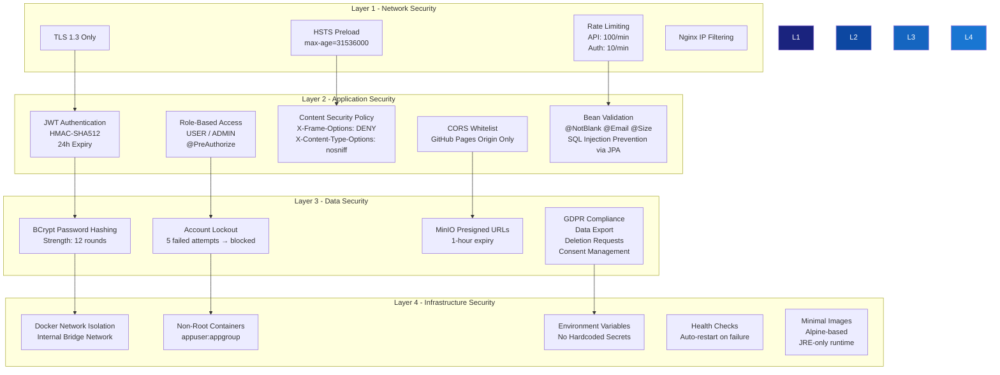

# Security Architecture (Defense in Depth)

## Security Checklist

| Control | Implementation | Status |
|---------|---------------|--------|
| HTTPS/TLS | Nginx TLS 1.2/1.3, HSTS preload | ✅ |
| Authentication | JWT (HMAC-SHA512, 24h expiry) | ✅ |
| Password Hashing | BCrypt strength 12 | ✅ |
| Account Lockout | Block after 5 failed logins | ✅ |
| RBAC | `@PreAuthorize("hasRole('ADMIN')")` | ✅ |
| CORS | Whitelist GitHub Pages origin | ✅ |
| CSP | Strict Content-Security-Policy header | ✅ |
| Rate Limiting | Nginx zones: 100/min API, 10/min auth | ✅ |
| Input Validation | Jakarta Bean Validation on all DTOs | ✅ |
| SQL Injection | JPA parameterized queries | ✅ |
| XSS | X-XSS-Protection, X-Content-Type-Options | ✅ |
| Clickjacking | X-Frame-Options: DENY | ✅ |
| File Upload | Type validation, size limits | ✅ |
| Presigned URLs | MinIO 1-hour expiry | ✅ |
| Secrets | Environment variables, never in code | ✅ |
| Container Security | Non-root user, Alpine minimal images | ✅ |
| GDPR | Export, deletion, consent management | ✅ |
| Health Monitoring | Docker health checks, auto-restart | ✅ |
