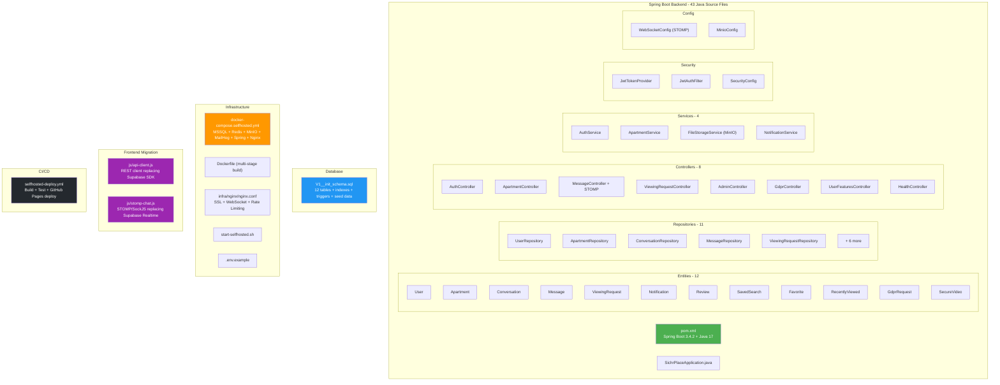

# Complete Deliverable Map

```mermaid
graph TB
    subgraph "Spring Boot Backend - 43 Java Source Files"
        POM["pom.xml<br/>Spring Boot 3.4.2 + Java 17"]
        APP[SichrPlaceApplication.java]
        subgraph "Entities - 12"
            E1[User]
            E2[Apartment]
            E3[Conversation]
            E4[Message]
            E5[ViewingRequest]
            E6[Notification]
            E7[Review]
            E8[SavedSearch]
            E9[Favorite]
            E10[RecentlyViewed]
            E11[GdprRequest]
            E12[SecureVideo]
        end
        subgraph "Repositories - 11"
            R1[UserRepository]
            R2[ApartmentRepository]
            R3[ConversationRepository]
            R4[MessageRepository]
            R5[ViewingRequestRepository]
            R6["+ 6 more"]
        end
        subgraph "Controllers - 8"
            C1[AuthController]
            C2[ApartmentController]
            C3["MessageController + STOMP"]
            C4[ViewingRequestController]
            C5[AdminController]
            C6[GdprController]
            C7[UserFeaturesController]
            C8[HealthController]
        end
        subgraph "Services - 4"
            S1[AuthService]
            S2[ApartmentService]
            S3["FileStorageService (MinIO)"]
            S4[NotificationService]
        end
        subgraph "Security"
            SEC1[JwtTokenProvider]
            SEC2[JwtAuthFilter]
            SEC3[SecurityConfig]
        end
        subgraph "Config"
            CFG1["WebSocketConfig (STOMP)"]
            CFG2[MinioConfig]
        end
    end

    subgraph "Database"
        SQL["V1__init_schema.sql<br/>12 tables + indexes + triggers + seed data"]
    end

    subgraph "Infrastructure"
        DC["docker-compose.selfhosted.yml<br/>MSSQL + Redis + MinIO + MailHog + Spring + Nginx"]
        DF["Dockerfile (multi-stage build)"]
        NX["infra/nginx/nginx.conf<br/>SSL + WebSocket + Rate Limiting"]
        SS[start-selfhosted.sh]
        ENV[.env.example]
    end

    subgraph "Frontend Migration"
        API["js/api-client.js<br/>REST client replacing Supabase SDK"]
        WS["js/stomp-chat.js<br/>STOMP/SockJS replacing Supabase Realtime"]
    end

    subgraph "CI/CD"
        GH["selfhosted-deploy.yml<br/>Build + Test + GitHub Pages deploy"]
    end

    style POM fill:#4CAF50,color:white
    style SQL fill:#2196F3,color:white
    style DC fill:#FF9800,color:white
    style API fill:#9C27B0,color:white
    style WS fill:#9C27B0,color:white
    style GH fill:#24292e,color:white
```
