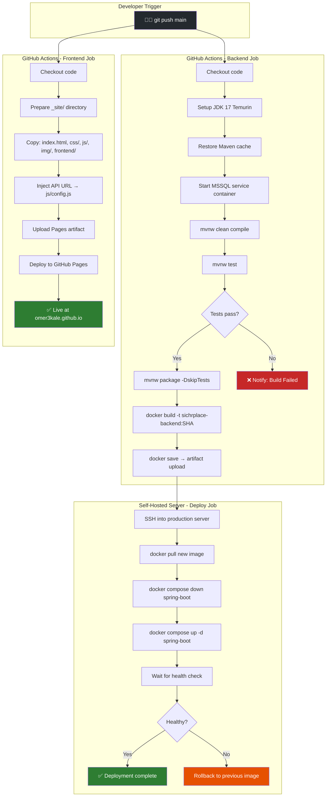

# CI/CD Pipeline - Full Automation Flow

```mermaid
flowchart TD
    subgraph "Developer Trigger"
        DEV[👨‍💻 git push main]
    end

    subgraph "GitHub Actions - Backend Job"
        B1[Checkout code]
        B2[Setup JDK 17 Temurin]
        B3[Restore Maven cache]
        B4[Start MSSQL service container]
        B5["mvnw clean compile"]
        B6["mvnw test"]
        B7{Tests pass?}
        B8["mvnw package -DskipTests"]
        B9["docker build -t sichrplace-backend:SHA"]
        B10[docker save → artifact upload]
        B_FAIL[❌ Notify: Build Failed]
    end

    subgraph "GitHub Actions - Frontend Job"
        F1[Checkout code]
        F2["Prepare _site/ directory"]
        F3["Copy: index.html, css/, js/, img/, frontend/"]
        F4["Inject API URL → js/config.js"]
        F5[Upload Pages artifact]
        F6[Deploy to GitHub Pages]
        F7["✅ Live at omer3kale.github.io"]
    end

    subgraph "Self-Hosted Server - Deploy Job"
        D1[SSH into production server]
        D2[docker pull new image]
        D3["docker compose down spring-boot"]
        D4["docker compose up -d spring-boot"]
        D5[Wait for health check]
        D6{Healthy?}
        D7["✅ Deployment complete"]
        D8[Rollback to previous image]
    end

    DEV --> B1
    B1 --> B2 --> B3 --> B4 --> B5 --> B6 --> B7
    B7 -->|Yes| B8 --> B9 --> B10
    B7 -->|No| B_FAIL

    DEV --> F1
    F1 --> F2 --> F3 --> F4 --> F5 --> F6 --> F7

    B10 --> D1
    D1 --> D2 --> D3 --> D4 --> D5 --> D6
    D6 -->|Yes| D7
    D6 -->|No| D8

    style DEV fill:#24292e,color:white
    style B_FAIL fill:#c62828,color:white
    style D7 fill:#2e7d32,color:white
    style F7 fill:#2e7d32,color:white
    style D8 fill:#e65100,color:white
```
