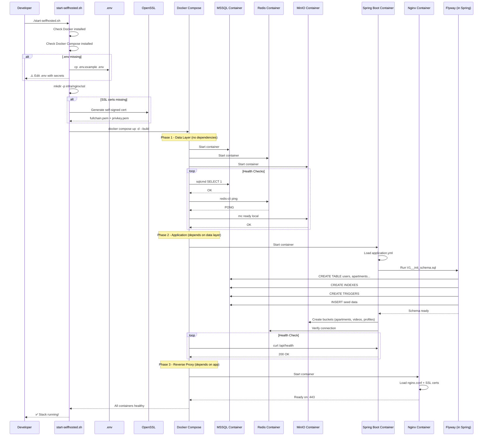

# One-Click Infrastructure Provisioning

```mermaid
sequenceDiagram
    participant DEV as Developer
    participant SH as start-selfhosted.sh
    participant ENV as .env
    participant SSL as OpenSSL
    participant DC as Docker Compose
    participant MSSQL as MSSQL Container
    participant REDIS as Redis Container
    participant MINIO as MinIO Container
    participant SPRING as Spring Boot Container
    participant NGINX as Nginx Container
    participant FW as Flyway (in Spring)

    DEV->>SH: ./start-selfhosted.sh
    SH->>SH: Check Docker installed
    SH->>SH: Check Docker Compose installed

    alt .env missing
        SH->>ENV: cp .env.example .env
        SH-->>DEV: ⚠️ Edit .env with secrets
    end

    SH->>SH: mkdir -p infra/nginx/ssl

    alt SSL certs missing
        SH->>SSL: Generate self-signed cert
        SSL-->>SH: fullchain.pem + privkey.pem
    end

    SH->>DC: docker compose up -d --build

    Note over DC: Phase 1 - Data Layer (no dependencies)
    DC->>MSSQL: Start container
    DC->>REDIS: Start container
    DC->>MINIO: Start container

    loop Health Checks
        DC->>MSSQL: sqlcmd SELECT 1
        MSSQL-->>DC: OK
        DC->>REDIS: redis-cli ping
        REDIS-->>DC: PONG
        DC->>MINIO: mc ready local
        MINIO-->>DC: OK
    end

    Note over DC: Phase 2 - Application (depends on data layer)
    DC->>SPRING: Start container
    SPRING->>SPRING: Load application.yml
    SPRING->>FW: Run V1__init_schema.sql
    FW->>MSSQL: CREATE TABLE users, apartments...
    FW->>MSSQL: CREATE INDEXES
    FW->>MSSQL: CREATE TRIGGERS
    FW->>MSSQL: INSERT seed data
    FW-->>SPRING: Schema ready
    SPRING->>MINIO: Create buckets (apartments, videos, profiles)
    SPRING->>REDIS: Verify connection

    loop Health Check
        DC->>SPRING: curl /api/health
        SPRING-->>DC: 200 OK
    end

    Note over DC: Phase 3 - Reverse Proxy (depends on app)
    DC->>NGINX: Start container
    NGINX->>NGINX: Load nginx.conf + SSL certs
    NGINX-->>DC: Ready on :443

    DC-->>SH: All containers healthy
    SH-->>DEV: ✅ Stack running!
```
