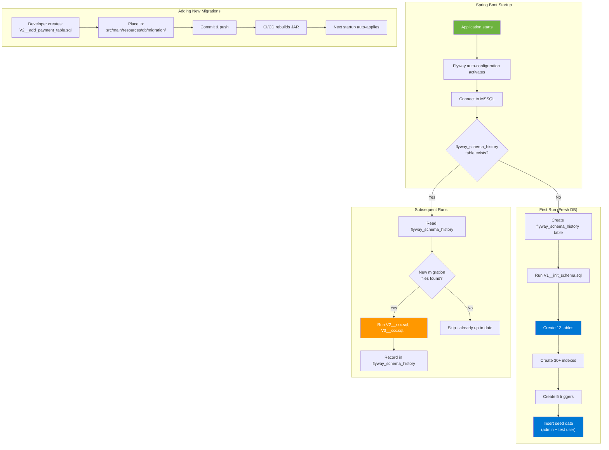

# Database Migration Automation (Flyway)



## Migration File Naming Convention

```
V{version}__{description}.sql

Examples:
  V1__init_schema.sql          ← Initial schema (already created)
  V2__add_payment_table.sql    ← Add payment tracking
  V3__add_audit_log.sql        ← Add audit logging
  V4__add_fulltext_search.sql  ← Add search indexes
```

## How To Add a New Table

```sql
-- File: V2__add_payments.sql
CREATE TABLE payments (
    id UNIQUEIDENTIFIER PRIMARY KEY DEFAULT NEWID(),
    user_id UNIQUEIDENTIFIER NOT NULL REFERENCES users(id),
    apartment_id UNIQUEIDENTIFIER NOT NULL REFERENCES apartments(id),
    amount DECIMAL(10,2) NOT NULL,
    currency NVARCHAR(3) DEFAULT 'EUR',
    paypal_order_id NVARCHAR(255),
    status NVARCHAR(20) DEFAULT 'pending',
    created_at DATETIMEOFFSET DEFAULT SYSDATETIMEOFFSET()
);

CREATE INDEX idx_payments_user ON payments(user_id);
CREATE INDEX idx_payments_status ON payments(status);
```

Then just restart the Spring Boot container — Flyway handles the rest automatically.
