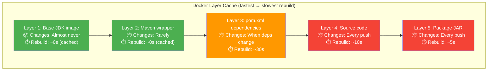
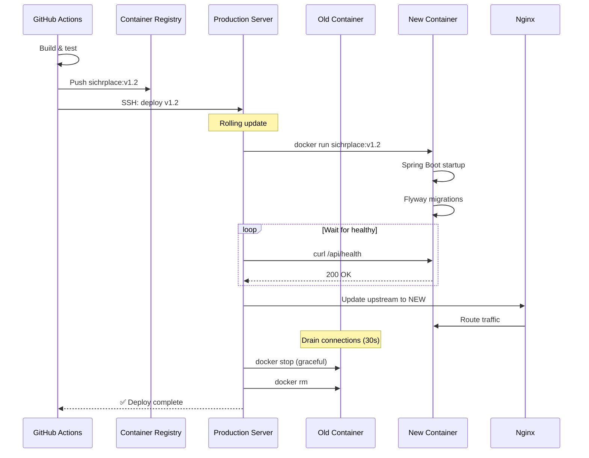

# Docker Build & Deploy Automation

```mermaid
flowchart LR
    subgraph "Build Phase (CI)"
        A["Dockerfile<br/>Stage 1: Builder"]
        B["FROM temurin:17-jdk-alpine"]
        C["COPY pom.xml + .mvn"]
        D["mvnw dependency:go-offline<br/>(cached layer)"]
        E["COPY src/"]
        F["mvnw package -DskipTests"]
        G["JAR artifact ready"]
    end

    subgraph "Package Phase"
        H["Stage 2: Runtime"]
        I["FROM temurin:17-jre-alpine"]
        J["Create non-root user"]
        K["COPY --from=builder app.jar"]
        L["HEALTHCHECK curl /api/health"]
        M["ENTRYPOINT java -jar"]
    end

    subgraph "Image Output"
        N["sichrplace-backend:SHA<br/>~150MB final size"]
    end

    A --> B --> C --> D --> E --> F --> G
    G --> H --> I --> J --> K --> L --> M --> N

    style A fill:#0db7ed,color:white
    style H fill:#0db7ed,color:white
    style N fill:#2e7d32,color:white
```

## Layer Caching Strategy

```mermaid
graph TB
    subgraph "Docker Layer Cache (fastest → slowest rebuild)"
        L1["Layer 1: Base JDK image<br/>📦 Changes: Almost never<br/>⏱️ Rebuild: ~0s (cached)"]
        L2["Layer 2: Maven wrapper<br/>📦 Changes: Rarely<br/>⏱️ Rebuild: ~0s (cached)"]
        L3["Layer 3: pom.xml dependencies<br/>📦 Changes: When deps change<br/>⏱️ Rebuild: ~30s"]
        L4["Layer 4: Source code<br/>📦 Changes: Every push<br/>⏱️ Rebuild: ~10s"]
        L5["Layer 5: Package JAR<br/>📦 Changes: Every push<br/>⏱️ Rebuild: ~5s"]

        L1 --> L2 --> L3 --> L4 --> L5
    end

    style L1 fill:#4CAF50,color:white
    style L2 fill:#4CAF50,color:white
    style L3 fill:#FF9800,color:white
    style L4 fill:#f44336,color:white
    style L5 fill:#f44336,color:white
```

## Zero-Downtime Deploy Sequence

```mermaid
sequenceDiagram
    participant CI as GitHub Actions
    participant REG as Container Registry
    participant SRV as Production Server
    participant OLD as Old Container
    participant NEW as New Container
    participant NGX as Nginx

    CI->>CI: Build & test
    CI->>REG: Push sichrplace:v1.2
    CI->>SRV: SSH: deploy v1.2

    Note over SRV: Rolling update
    SRV->>NEW: docker run sichrplace:v1.2
    NEW->>NEW: Spring Boot startup
    NEW->>NEW: Flyway migrations

    loop Wait for healthy
        SRV->>NEW: curl /api/health
        NEW-->>SRV: 200 OK
    end

    SRV->>NGX: Update upstream to NEW
    NGX->>NEW: Route traffic

    Note over OLD: Drain connections (30s)
    SRV->>OLD: docker stop (graceful)
    SRV->>OLD: docker rm

    SRV-->>CI: ✅ Deploy complete
```
