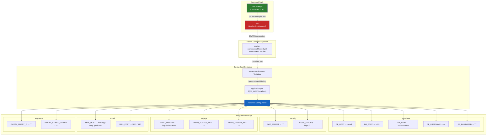
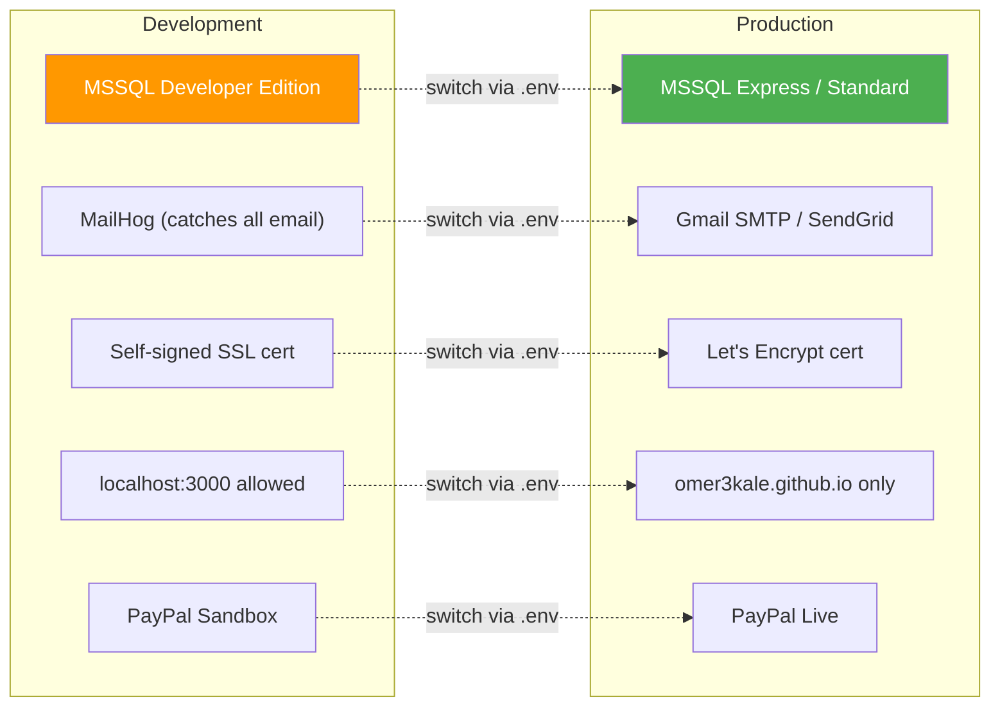

# Environment Configuration Flow

```mermaid
flowchart TD
    subgraph "Source of Truth"
        ENVEX[".env.example<br/>(committed to git)"]
        ENV[".env<br/>(local only, gitignored)"]
    end

    subgraph "Docker Compose Injection"
        DC["docker-compose.selfhosted.yml<br/>environment: section"]
    end

    subgraph "Spring Boot Container"
        SYS["System Environment Variables"]
        YML["application.yml<br/>${DB_HOST:localhost}"]
        RESOLVED["Resolved Configuration"]
    end

    subgraph "Configuration Groups"
        subgraph "Database"
            DB_H["DB_HOST → mssql"]
            DB_P["DB_PORT → 1433"]
            DB_N["DB_NAME → SichrPlaceDB"]
            DB_U["DB_USERNAME → sa"]
            DB_PW["DB_PASSWORD → ***"]
        end

        subgraph "Security"
            JWT["JWT_SECRET → ***"]
            CORS["CORS_ORIGINS → https://..."]
        end

        subgraph "Storage"
            M_EP["MINIO_ENDPOINT → http://minio:9000"]
            M_AK["MINIO_ACCESS_KEY → ***"]
            M_SK["MINIO_SECRET_KEY → ***"]
        end

        subgraph "Email"
            ML_H["MAIL_HOST → mailhog / smtp.gmail.com"]
            ML_P["MAIL_PORT → 1025 / 587"]
        end

        subgraph "Payments"
            PP_ID["PAYPAL_CLIENT_ID → ***"]
            PP_SK["PAYPAL_CLIENT_SECRET → ***"]
        end
    end

    ENVEX -->|"cp .env.example .env"| ENV
    ENV -->|"${VAR} interpolation"| DC
    DC -->|"container env"| SYS
    SYS -->|"Spring relaxed binding"| YML
    YML --> RESOLVED

    RESOLVED --> DB_H & DB_P & DB_N & DB_U & DB_PW
    RESOLVED --> JWT & CORS
    RESOLVED --> M_EP & M_AK & M_SK
    RESOLVED --> ML_H & ML_P
    RESOLVED --> PP_ID & PP_SK

    style ENV fill:#c62828,color:white
    style ENVEX fill:#2e7d32,color:white
    style RESOLVED fill:#1565c0,color:white
```

## Per-Environment Overrides

```mermaid
graph LR
    subgraph "Development"
        DEV_DB["MSSQL Developer Edition"]
        DEV_MAIL["MailHog (catches all email)"]
        DEV_SSL["Self-signed SSL cert"]
        DEV_CORS["localhost:3000 allowed"]
        DEV_PP["PayPal Sandbox"]
    end

    subgraph "Production"
        PROD_DB["MSSQL Express / Standard"]
        PROD_MAIL["Gmail SMTP / SendGrid"]
        PROD_SSL["Let's Encrypt cert"]
        PROD_CORS["omer3kale.github.io only"]
        PROD_PP["PayPal Live"]
    end

    DEV_DB -.->|"switch via .env"| PROD_DB
    DEV_MAIL -.->|"switch via .env"| PROD_MAIL
    DEV_SSL -.->|"switch via .env"| PROD_SSL
    DEV_CORS -.->|"switch via .env"| PROD_CORS
    DEV_PP -.->|"switch via .env"| PROD_PP

    style DEV_DB fill:#FF9800,color:white
    style PROD_DB fill:#4CAF50,color:white
```
