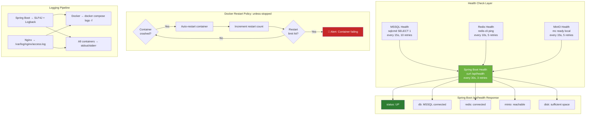
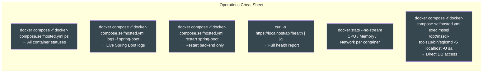

# Monitoring, Health Checks & Auto-Recovery

```mermaid
flowchart TD
    subgraph "Health Check Layer"
        HC_MSSQL["MSSQL Health<br/>sqlcmd SELECT 1<br/>every 15s, 10 retries"]
        HC_REDIS["Redis Health<br/>redis-cli ping<br/>every 10s, 5 retries"]
        HC_MINIO["MinIO Health<br/>mc ready local<br/>every 15s, 5 retries"]
        HC_SPRING["Spring Boot Health<br/>curl /api/health<br/>every 30s, 3 retries"]
    end

    subgraph "Docker Restart Policy: unless-stopped"
        R1{"Container<br/>crashed?"}
        R2[Auto-restart container]
        R3[Increment restart count]
        R4{Restart<br/>limit hit?}
        R5["🔴 Alert: Container failing"]
    end

    subgraph "Spring Boot /api/health Response"
        H1["status: UP"]
        H2["db: MSSQL connected"]
        H3["redis: connected"]
        H4["minio: reachable"]
        H5["disk: sufficient space"]
    end

    subgraph "Logging Pipeline"
        LOG1["Spring Boot → SLF4J + Logback"]
        LOG2["Nginx → /var/log/nginx/access.log"]
        LOG3["Docker → docker compose logs -f"]
        LOG4["All containers → stdout/stderr"]
    end

    HC_MSSQL & HC_REDIS & HC_MINIO --> HC_SPRING
    HC_SPRING --> H1 & H2 & H3 & H4 & H5

    R1 -->|Yes| R2 --> R3 --> R4
    R4 -->|No| R1
    R4 -->|Yes| R5

    LOG1 & LOG2 --> LOG3 & LOG4

    style HC_SPRING fill:#6DB33F,color:white
    style R5 fill:#c62828,color:white
    style H1 fill:#2e7d32,color:white
```

## Automated Monitoring Commands

```mermaid
graph LR
    subgraph "Operations Cheat Sheet"
        CMD1["docker compose -f docker-compose.selfhosted.yml ps<br/>→ All container statuses"]
        CMD2["docker compose -f docker-compose.selfhosted.yml logs -f spring-boot<br/>→ Live Spring Boot logs"]
        CMD3["docker compose -f docker-compose.selfhosted.yml restart spring-boot<br/>→ Restart backend only"]
        CMD4["curl -s https://localhost/api/health | jq<br/>→ Full health report"]
        CMD5["docker stats --no-stream<br/>→ CPU / Memory / Network per container"]
        CMD6["docker compose -f docker-compose.selfhosted.yml exec mssql<br/>/opt/mssql-tools18/bin/sqlcmd -S localhost -U sa<br/>→ Direct DB access"]
    end

    style CMD1 fill:#37474f,color:white
    style CMD2 fill:#37474f,color:white
    style CMD3 fill:#37474f,color:white
    style CMD4 fill:#37474f,color:white
    style CMD5 fill:#37474f,color:white
    style CMD6 fill:#37474f,color:white
```
