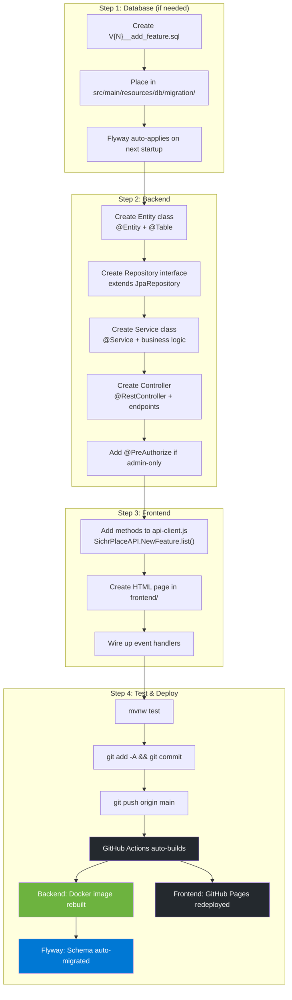
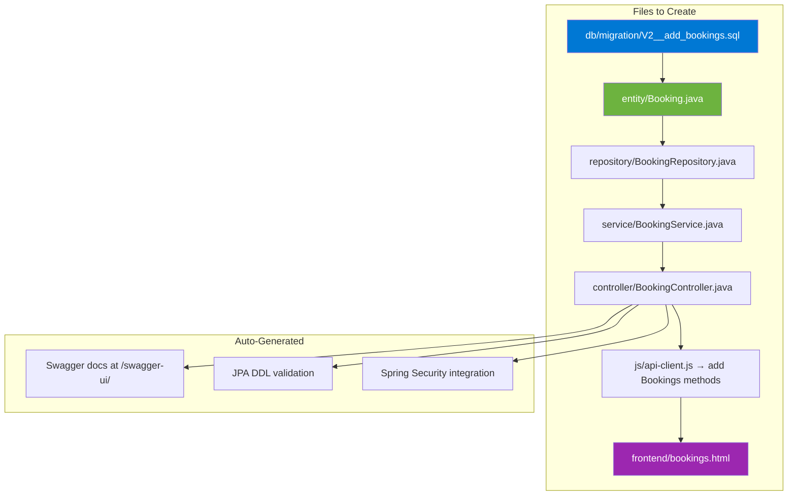

# New Feature Automation Workflow

> How to add a new feature end-to-end with zero manual intervention.



## Example: Adding a "Booking" Feature



## API Client Extension Pattern

```javascript
// Just add to js/api-client.js:
const Bookings = {
    list()          { return get('/api/bookings'); },
    getById(id)     { return get(`/api/bookings/${id}`); },
    create(data)    { return post('/api/bookings', data); },
    cancel(id)      { return del(`/api/bookings/${id}`); },
    confirm(id)     { return put(`/api/bookings/${id}/confirm`); },
};

// Then expose in the return block:
return { ...existing, Bookings };
```
