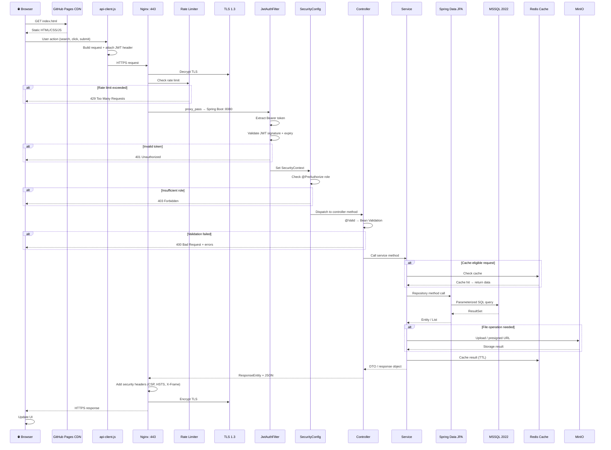

# End-to-End Request Lifecycle

> Every HTTP request from browser keystroke to database and back.

```mermaid
sequenceDiagram
    participant Browser as 🌐 Browser
    participant GHP as GitHub Pages CDN
    participant JS as api-client.js
    participant NGX as Nginx :443
    participant RATE as Rate Limiter
    participant SSL as TLS 1.3
    participant FILTER as JwtAuthFilter
    participant SEC as SecurityConfig
    participant CTRL as Controller
    participant SVC as Service
    participant JPA as Spring Data JPA
    participant MSSQL as MSSQL 2022
    participant REDIS as Redis Cache
    participant MINIO as MinIO

    Browser->>GHP: GET index.html
    GHP-->>Browser: Static HTML/CSS/JS

    Browser->>JS: User action (search, click, submit)
    JS->>JS: Build request + attach JWT header

    JS->>NGX: HTTPS request
    NGX->>SSL: Decrypt TLS
    NGX->>RATE: Check rate limit
    
    alt Rate limit exceeded
        RATE-->>Browser: 429 Too Many Requests
    end

    NGX->>FILTER: proxy_pass → Spring Boot :8080
    FILTER->>FILTER: Extract Bearer token
    FILTER->>FILTER: Validate JWT signature + expiry
    
    alt Invalid token
        FILTER-->>Browser: 401 Unauthorized
    end

    FILTER->>SEC: Set SecurityContext
    SEC->>SEC: Check @PreAuthorize role

    alt Insufficient role
        SEC-->>Browser: 403 Forbidden
    end

    SEC->>CTRL: Dispatch to controller method
    CTRL->>CTRL: @Valid → Bean Validation
    
    alt Validation failed
        CTRL-->>Browser: 400 Bad Request + errors
    end

    CTRL->>SVC: Call service method

    alt Cache-eligible request
        SVC->>REDIS: Check cache
        REDIS-->>SVC: Cache hit → return data
    end

    SVC->>JPA: Repository method call
    JPA->>MSSQL: Parameterized SQL query
    MSSQL-->>JPA: ResultSet
    JPA-->>SVC: Entity / List

    alt File operation needed
        SVC->>MINIO: Upload / presigned URL
        MINIO-->>SVC: Storage result
    end

    SVC->>REDIS: Cache result (TTL)
    SVC-->>CTRL: DTO / response object
    CTRL-->>NGX: ResponseEntity + JSON
    NGX->>NGX: Add security headers (CSP, HSTS, X-Frame)
    NGX->>SSL: Encrypt TLS
    NGX-->>Browser: HTTPS response

    Browser->>Browser: Update UI
```
