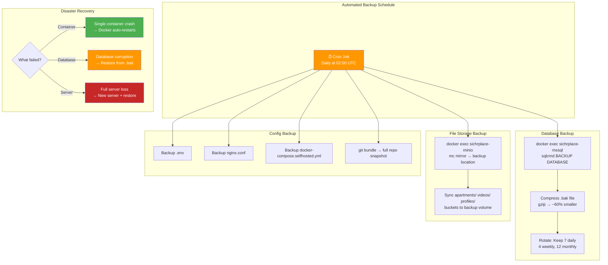
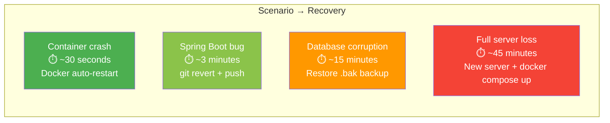

# Backup & Disaster Recovery Automation



## Recovery Time Estimates



## Backup Script (Automated)

```bash
#!/bin/bash
# backup-sichrplace.sh — Run via cron: 0 2 * * *

DATE=$(date +%Y%m%d_%H%M)
BACKUP_DIR=/backups/sichrplace/$DATE
mkdir -p $BACKUP_DIR

# 1. Database
docker exec sichrplace-mssql /opt/mssql-tools18/bin/sqlcmd \
  -S localhost -U sa -P "$DB_PASSWORD" -C \
  -Q "BACKUP DATABASE SichrPlaceDB TO DISK='/var/opt/mssql/backup_$DATE.bak'"
docker cp sichrplace-mssql:/var/opt/mssql/backup_$DATE.bak $BACKUP_DIR/
gzip $BACKUP_DIR/backup_$DATE.bak

# 2. MinIO files
docker exec sichrplace-minio mc mirror /data $BACKUP_DIR/minio/

# 3. Config
cp .env docker-compose.selfhosted.yml $BACKUP_DIR/

# 4. Rotate (keep 7 days)
find /backups/sichrplace -maxdepth 1 -mtime +7 -exec rm -rf {} \;

echo "✅ Backup complete: $BACKUP_DIR"
```
