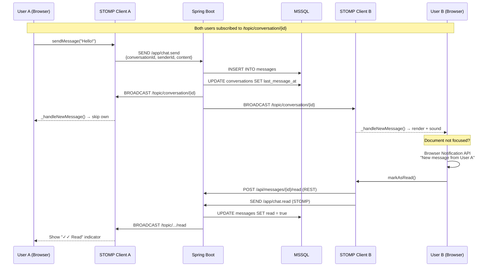
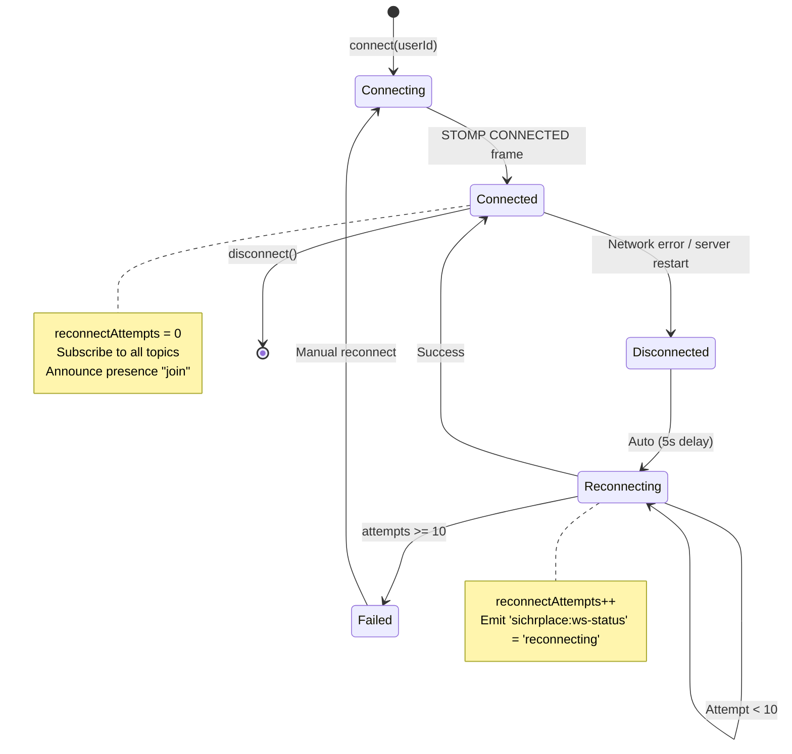

# WebSocket & Real-Time Architecture

> Full STOMP topic routing, subscriptions, typing indicators, presence, and read receipts.

## Connection & Topic Routing

```mermaid
flowchart TD
    subgraph "Browser (SichrPlaceChat class)"
        SOCK["SockJS connects to /ws"]
        STOMP["STOMP Client activates"]
        AUTH_H["Sends Authorization: Bearer JWT"]
    end

    subgraph "Spring Boot"
        EP["/ws endpoint<br/>WebSocketConfig"]
        BROKER["SimpleBroker<br/>/topic, /queue"]
        APP_PREFIX["/app destination prefix"]
    end

    subgraph "STOMP Destinations"
        direction TB
        T1["/topic/conversation/{id}<br/>← New messages"]
        T2["/topic/conversation/{id}/typing<br/>← Typing indicators"]
        T3["/topic/conversation/{id}/read<br/>← Read receipts"]
        T4["/topic/conversation/{id}/presence<br/>← Join/Leave events"]
        T5["/queue/notifications/{userId}<br/>← Personal notifications"]
    end

    subgraph "Server-Side Handlers (MessageController)"
        H1["@MessageMapping('/chat.send')<br/>→ Save to DB → Broadcast"]
        H2["@MessageMapping('/chat.typing')<br/>→ Broadcast typing state"]
        H3["@MessageMapping('/chat.presence')<br/>→ Broadcast join/leave"]
    end

    SOCK -->|"SockJS/HTTP fallback"| EP
    STOMP -->|"CONNECT frame"| AUTH_H
    EP --> BROKER

    STOMP -->|"SUBSCRIBE"| T1 & T2 & T3 & T4 & T5
    STOMP -->|"SEND /app/chat.send"| H1
    STOMP -->|"SEND /app/chat.typing"| H2
    STOMP -->|"SEND /app/chat.presence"| H3

    H1 -->|"SimpMessagingTemplate"| T1
    H2 -->|"SimpMessagingTemplate"| T2
    H3 -->|"SimpMessagingTemplate"| T4

    style SOCK fill:#FF9800,color:white
    style BROKER fill:#6DB33F,color:white
    style T1 fill:#1565c0,color:white
    style T5 fill:#9C27B0,color:white
```

## Message Send Sequence (Bidirectional)

## Reconnection Strategy

