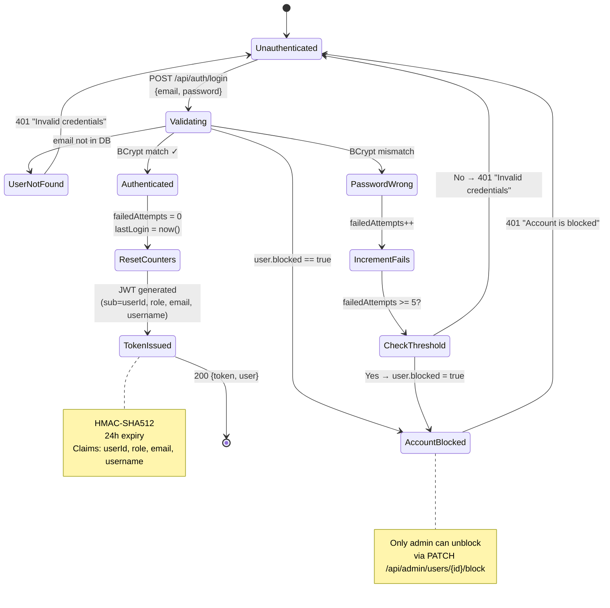
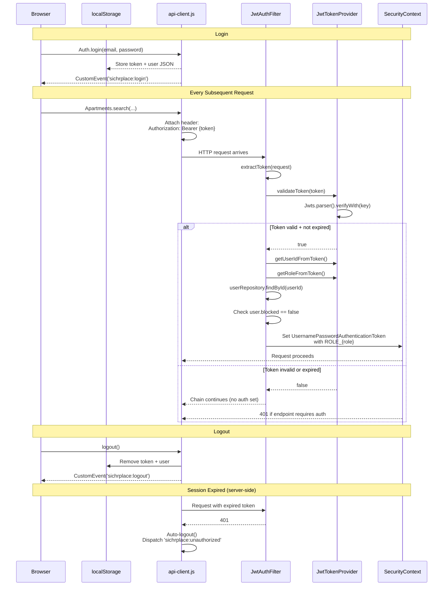
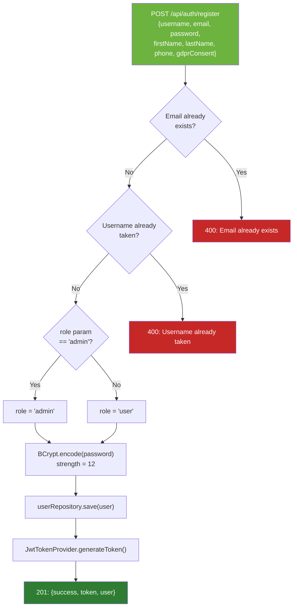

# JWT Authentication State Machine

> Login flow with 5-attempt lockout, account blocking, token lifecycle.

## Login State Machine

```mermaid
stateDiagram-v2
    [*] --> Unauthenticated

    Unauthenticated --> Validating: POST /api/auth/login<br/>{email, password}

    Validating --> UserNotFound: email not in DB
    Validating --> AccountBlocked: user.blocked == true
    Validating --> PasswordWrong: BCrypt mismatch
    Validating --> Authenticated: BCrypt match ✓

    UserNotFound --> Unauthenticated: 401 "Invalid credentials"

    AccountBlocked --> Unauthenticated: 401 "Account is blocked"

    PasswordWrong --> IncrementFails: failedAttempts++
    IncrementFails --> CheckThreshold: failedAttempts >= 5?

    CheckThreshold --> AccountBlocked: Yes → user.blocked = true
    CheckThreshold --> Unauthenticated: No → 401 "Invalid credentials"

    Authenticated --> ResetCounters: failedAttempts = 0<br/>lastLogin = now()
    ResetCounters --> TokenIssued: JWT generated<br/>(sub=userId, role, email, username)
    TokenIssued --> [*]: 200 {token, user}

    note right of TokenIssued
        HMAC-SHA512
        24h expiry
        Claims: userId, role, email, username
    end note

    note right of AccountBlocked
        Only admin can unblock
        via PATCH /api/admin/users/{id}/block
    end note
```

## Token Lifecycle

```mermaid
sequenceDiagram
    participant B as Browser
    participant LS as localStorage
    participant API as api-client.js
    participant JWT as JwtAuthFilter
    participant PROV as JwtTokenProvider
    participant SEC as SecurityContext

    Note over B,SEC: Login
    B->>API: Auth.login(email, password)
    API-->>LS: Store token + user JSON
    API-->>B: CustomEvent('sichrplace:login')

    Note over B,SEC: Every Subsequent Request
    B->>API: Apartments.search(...)
    API->>API: Attach header:<br/>Authorization: Bearer {token}
    API->>JWT: HTTP request arrives

    JWT->>JWT: extractToken(request)
    JWT->>PROV: validateToken(token)
    PROV->>PROV: Jwts.parser().verifyWith(key)
    
    alt Token valid + not expired
        PROV-->>JWT: true
        JWT->>PROV: getUserIdFromToken()
        JWT->>PROV: getRoleFromToken()
        JWT->>JWT: userRepository.findById(userId)
        JWT->>JWT: Check user.blocked == false
        JWT->>SEC: Set UsernamePasswordAuthenticationToken<br/>with ROLE_{role}
        SEC-->>API: Request proceeds
    else Token invalid or expired
        PROV-->>JWT: false
        JWT-->>API: Chain continues (no auth set)
        SEC-->>API: 401 if endpoint requires auth
    end

    Note over B,SEC: Logout
    B->>API: logout()
    API->>LS: Remove token + user
    API-->>B: CustomEvent('sichrplace:logout')

    Note over B,SEC: Session Expired (server-side)
    API->>JWT: Request with expired token
    JWT-->>API: 401
    API->>API: Auto-logout()<br/>Dispatch 'sichrplace:unauthorized'
```

## Registration Flow

```mermaid
flowchart TD
    REQ["POST /api/auth/register<br/>{username, email, password,<br/>firstName, lastName, phone, gdprConsent}"]

    CHK_EMAIL{"Email already<br/>exists?"}
    CHK_USER{"Username already<br/>taken?"}

    ROLE{"role param<br/>== 'admin'?"}
    SET_ADMIN["role = 'admin'"]
    SET_USER["role = 'user'"]

    HASH["BCrypt.encode(password)<br/>strength = 12"]
    SAVE["userRepository.save(user)"]
    TOKEN["JwtTokenProvider.generateToken()"]
    RESP["201: {success, token, user}"]

    ERR_EMAIL["400: Email already exists"]
    ERR_USER["400: Username already taken"]

    REQ --> CHK_EMAIL
    CHK_EMAIL -->|Yes| ERR_EMAIL
    CHK_EMAIL -->|No| CHK_USER
    CHK_USER -->|Yes| ERR_USER
    CHK_USER -->|No| ROLE
    ROLE -->|Yes| SET_ADMIN
    ROLE -->|No| SET_USER
    SET_ADMIN & SET_USER --> HASH --> SAVE --> TOKEN --> RESP

    style REQ fill:#6DB33F,color:white
    style RESP fill:#2e7d32,color:white
    style ERR_EMAIL fill:#c62828,color:white
    style ERR_USER fill:#c62828,color:white
```
