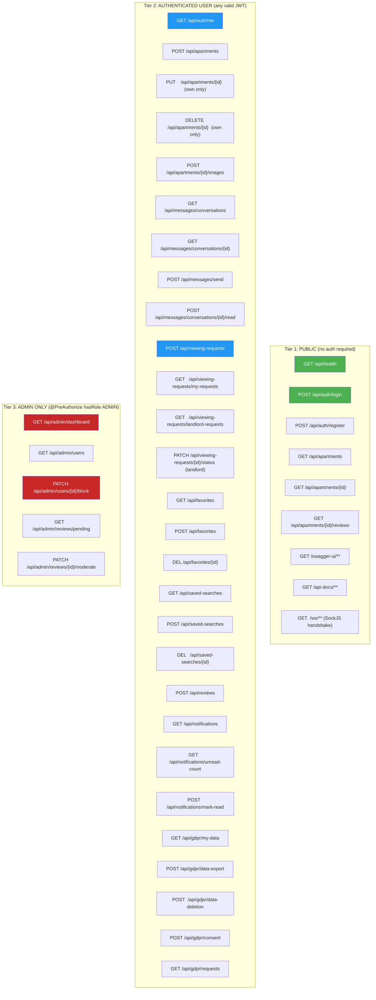
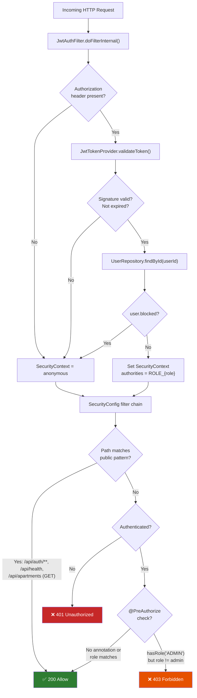
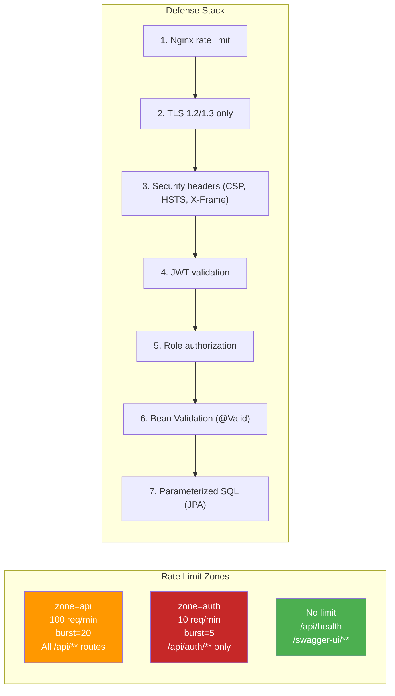

# Role-Based Access Control (RBAC) Matrix

> Complete endpoint → required role mapping derived from SecurityConfig and @PreAuthorize annotations.

## Access Control Tiers

## Authorization Decision Flow

## Nginx Rate Limiting by Endpoint Category

