# Complete REST API Surface Map

> All 8 controllers, 30+ endpoints, HTTP methods, auth requirements.

```mermaid
graph TD
    subgraph "🔓 AuthController — /api/auth"
        AUTH_LOGIN["POST /login<br/>Public • zone=auth 10r/m<br/>→ {token, user}"]
        AUTH_REG["POST /register<br/>Public • zone=auth 10r/m<br/>→ {token, user}"]
        AUTH_ME["GET /me<br/>Authenticated<br/>→ {id, email, role, name}"]
    end

    subgraph "🏠 ApartmentController — /api/apartments"
        APT_LIST["GET /<br/>Public • Paginated<br/>?city&minPrice&maxPrice&minRooms"]
        APT_GET["GET /{id}<br/>Public<br/>→ Apartment details"]
        APT_CREATE["POST /<br/>Authenticated<br/>→ New apartment"]
        APT_UPDATE["PUT /{id}<br/>Authenticated (owner/admin)<br/>→ Updated apartment"]
        APT_DELETE["DELETE /{id}<br/>Authenticated (owner/admin)<br/>→ {success}"]
        APT_IMG["POST /{id}/images<br/>Authenticated (owner)<br/>multipart/form-data → {imageUrl}"]
    end

    subgraph "💬 MessageController — /api/messages"
        MSG_CONV["GET /conversations<br/>Authenticated<br/>→ List conversations"]
        MSG_MSGS["GET /conversations/{id}<br/>Authenticated • Paginated<br/>→ Messages"]
        MSG_SEND["POST /send<br/>Authenticated<br/>→ Message + WS broadcast"]
        MSG_READ["POST /conversations/{id}/read<br/>Authenticated<br/>→ {markedRead: N}"]
    end

    subgraph "📅 ViewingRequestController — /api/viewing-requests"
        VR_CREATE["POST /<br/>Authenticated<br/>→ ViewingRequest + notification"]
        VR_MINE["GET /my-requests<br/>Authenticated (requester)<br/>→ List"]
        VR_LANDLORD["GET /landlord-requests<br/>Authenticated (landlord)<br/>→ List"]
        VR_STATUS["PATCH /{id}/status<br/>Authenticated (landlord/admin)<br/>→ {status}"]
    end

    subgraph "⭐ UserFeaturesController — /api"
        FAV_LIST["GET /favorites<br/>Authenticated"]
        FAV_ADD["POST /favorites<br/>Authenticated"]
        FAV_DEL["DELETE /favorites/{aptId}<br/>Authenticated"]
        SS_LIST["GET /saved-searches<br/>Authenticated"]
        SS_ADD["POST /saved-searches<br/>Authenticated"]
        SS_DEL["DELETE /saved-searches/{id}<br/>Authenticated"]
        REV_LIST["GET /apartments/{id}/reviews<br/>Public • Paginated"]
        REV_CREATE["POST /reviews<br/>Authenticated • status=pending"]
        NOTIF_LIST["GET /notifications<br/>Authenticated • Paginated"]
        NOTIF_COUNT["GET /notifications/unread-count<br/>Authenticated"]
        NOTIF_READ["POST /notifications/mark-read<br/>Authenticated"]
    end

    subgraph "🛡️ AdminController — /api/admin"
        ADM_DASH["GET /dashboard<br/>ADMIN only<br/>→ {totalUsers, totalApartments, ...}"]
        ADM_USERS["GET /users<br/>ADMIN only • Paginated"]
        ADM_BLOCK["PATCH /users/{id}/block<br/>ADMIN only → toggle blocked"]
        ADM_REVIEWS["GET /reviews/pending<br/>ADMIN only • Paginated"]
        ADM_MOD["PATCH /reviews/{id}/moderate<br/>ADMIN only → {status, note}"]
    end

    subgraph "🇪🇺 GdprController — /api/gdpr"
        GDPR_DATA["GET /my-data<br/>Authenticated<br/>→ {user, gdprRequests}"]
        GDPR_EXPORT["POST /data-export<br/>Authenticated<br/>→ JSON serialization"]
        GDPR_DELETE["POST /data-deletion<br/>Authenticated<br/>→ 30-day pending"]
        GDPR_CONSENT["POST /consent<br/>Authenticated<br/>→ {consent: bool}"]
        GDPR_REQS["GET /requests<br/>Authenticated<br/>→ List requests"]
    end

    subgraph "❤️ HealthController — /api"
        HEALTH["GET /health<br/>Public • No rate limit<br/>→ {status, uptime, version}"]
    end

    subgraph "📡 STOMP WebSocket — /ws"
        WS_SEND["@MessageMapping /chat.send<br/>→ persist + broadcast"]
        WS_TYPING["@MessageMapping /chat.typing<br/>→ broadcast indicator"]
    end

    style AUTH_LOGIN fill:#4CAF50,color:white
    style APT_LIST fill:#4CAF50,color:white
    style HEALTH fill:#4CAF50,color:white
    style ADM_DASH fill:#c62828,color:white
    style ADM_BLOCK fill:#c62828,color:white
    style GDPR_DELETE fill:#FF9800,color:white
```

## Endpoint Count Summary

| Controller | Endpoints | Public | Auth Required | Admin Only |
|------------|-----------|--------|---------------|------------|
| Auth | 3 | 2 | 1 | 0 |
| Apartment | 6 | 2 | 4 | 0 |
| Message | 4 | 0 | 4 | 0 |
| ViewingRequest | 4 | 0 | 4 | 0 |
| UserFeatures | 11 | 1 | 10 | 0 |
| Admin | 5 | 0 | 0 | 5 |
| GDPR | 5 | 0 | 5 | 0 |
| Health | 1 | 1 | 0 | 0 |
| WebSocket | 2 | 0 | 2 | 0 |
| **Total** | **41** | **6** | **30** | **5** |
