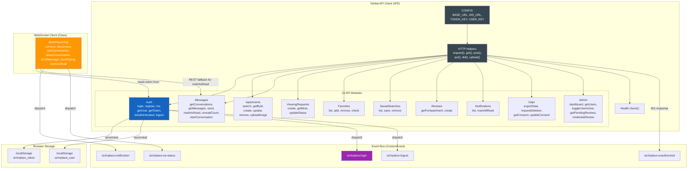
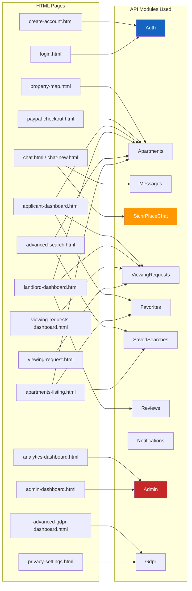
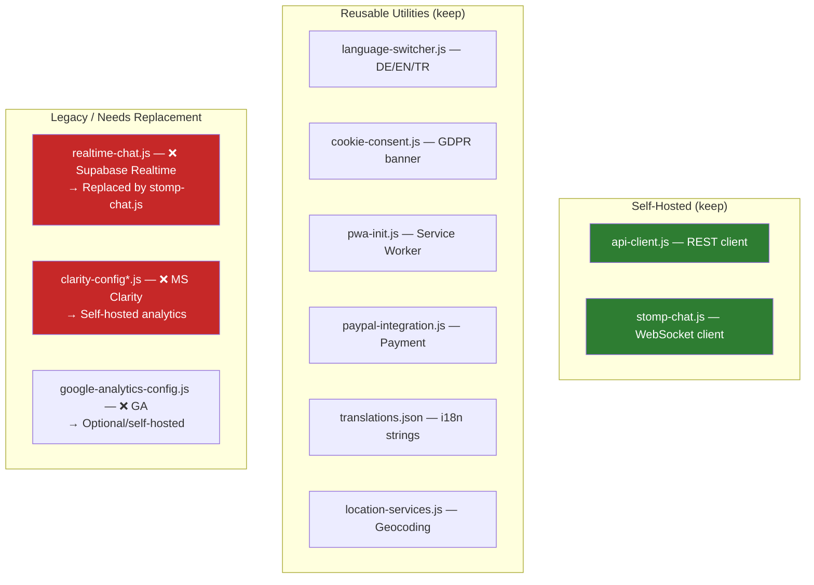

# Frontend Module Architecture

> api-client.js (10 modules), SichrPlaceChat class, event bus, and page mappings.

## Module Dependency Graph

## Frontend Pages → API Module Mapping

## Utility JS Files

