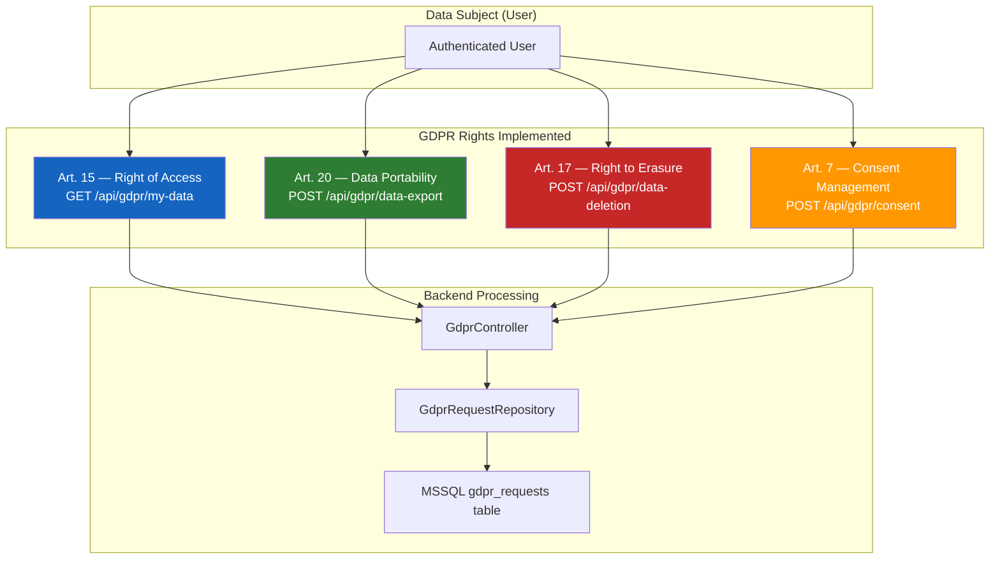
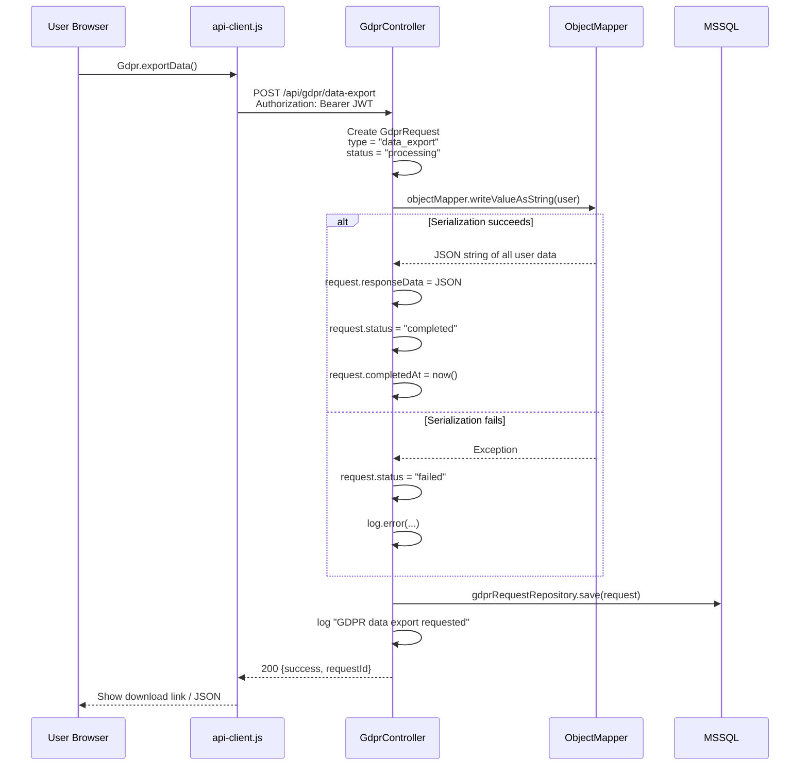
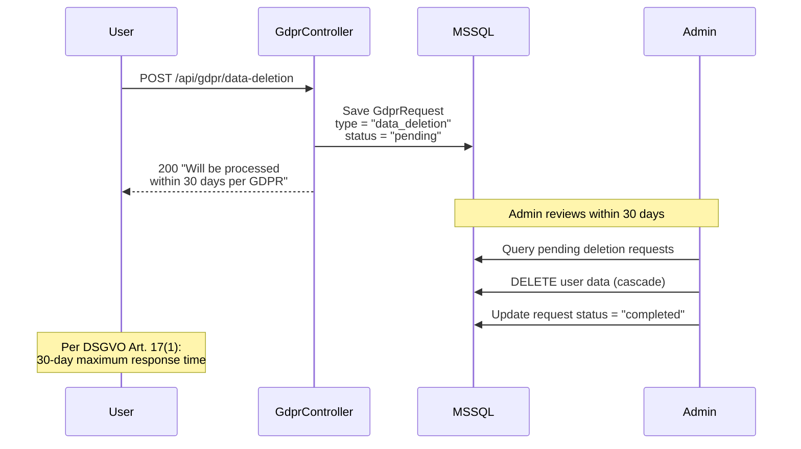
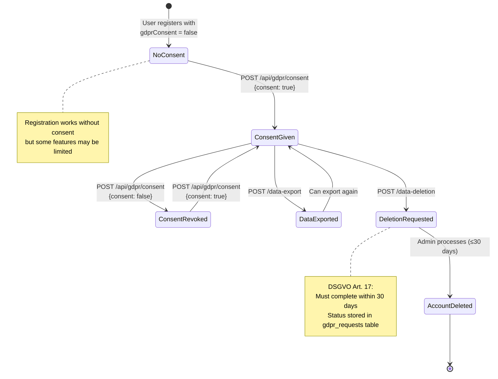
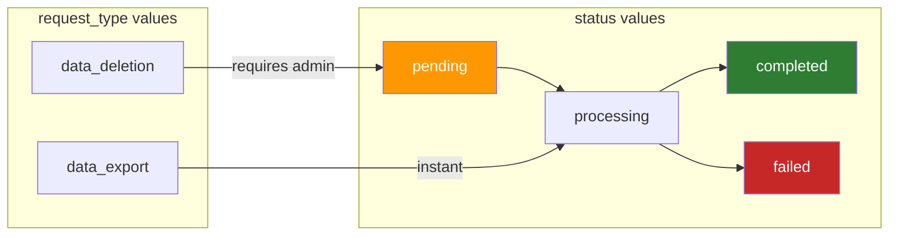

# GDPR Compliance Flows

> Data export, 30-day deletion, consent management — EU DSGVO Article 15/17/7 compliance.

## GDPR Operations Overview

## Data Export Flow (Art. 20)

## Data Deletion Flow (Art. 17)

## Consent State Machine

## GdprRequest Database States

