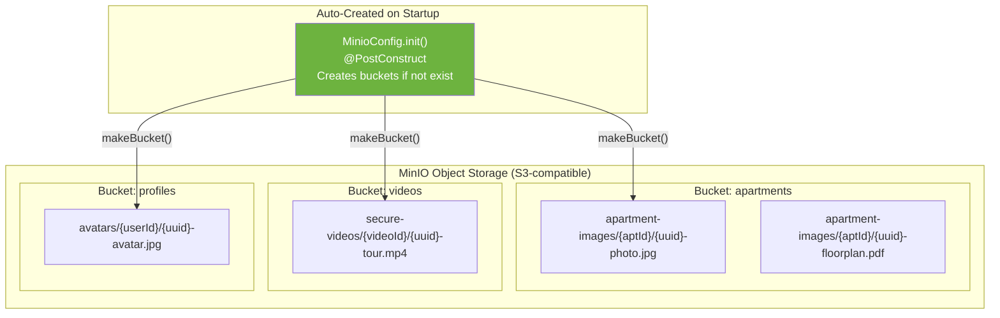
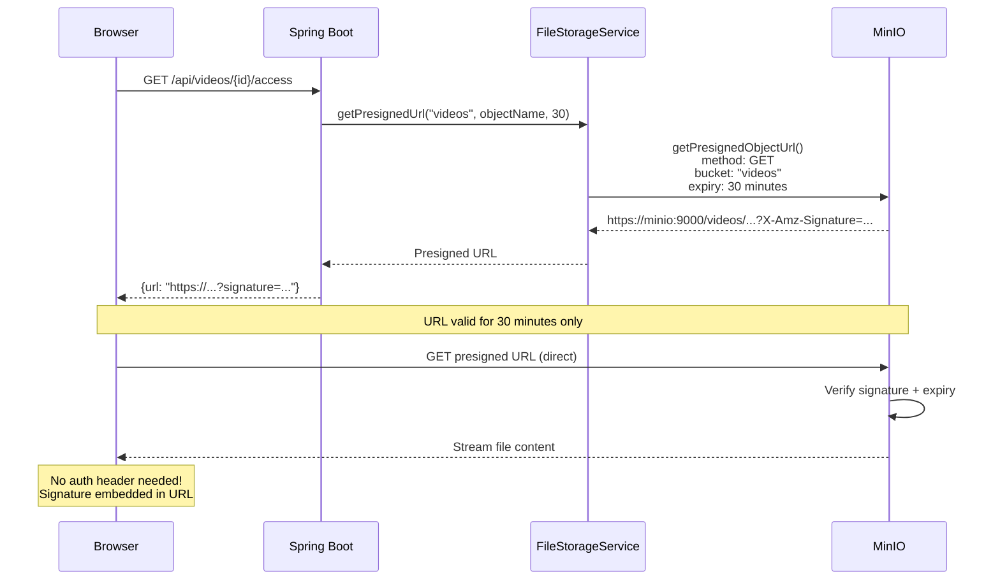
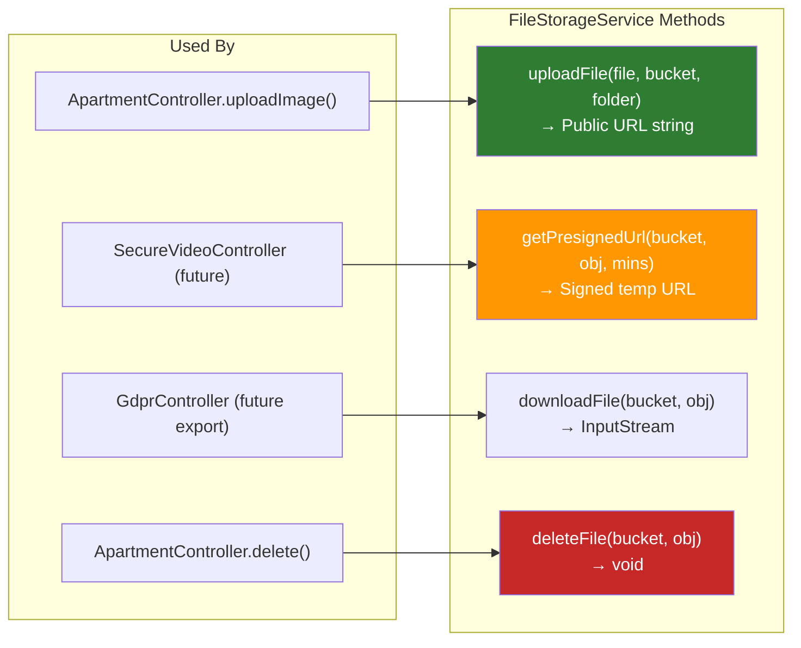

# MinIO File Storage Pipeline

> Upload, access via presigned URLs, bucket layout, and lifecycle.

## Bucket Structure



## Upload Flow

```mermaid
sequenceDiagram
    participant B as Browser
    participant API as api-client.js
    participant CTRL as ApartmentController
    participant SVC as FileStorageService
    participant MINIO as MinIO Container

    B->>B: User selects file<br/><input type="file">
    B->>API: Apartments.uploadImage(aptId, file)
    API->>API: Build FormData<br/>append('file', file)
    API->>CTRL: POST /api/apartments/{id}/images<br/>Content-Type: multipart/form-data<br/>Authorization: Bearer JWT

    CTRL->>CTRL: Verify user owns apartment
    
    alt Not owner
        CTRL-->>API: 404 Not Found
    end

    CTRL->>SVC: uploadFile(file, "apartment-images", aptId)

    SVC->>SVC: Generate filename:<br/>{folder}/{UUID}-{originalName}
    SVC->>MINIO: MinioClient.putObject()<br/>bucket: "apartments"<br/>object: filename<br/>stream: file.getInputStream()<br/>contentType: file.getContentType()

    MINIO-->>SVC: Object stored
    SVC->>SVC: Build URL:<br/>minioEndpoint/apartments/filename
    SVC-->>CTRL: URL string
    CTRL-->>API: 200 {success, imageUrl}
    API-->>B: Display uploaded image
```



## Presigned URL Access (Secure Downloads)



## Storage Operations Available



## MinIO Docker Configuration

```
Container: sichrplace-minio
Image:     minio/minio:latest
Ports:     9000 (API) / 9001 (Console UI)
Volume:    minio_data:/data (persistent)
Creds:     MINIO_ROOT_USER / MINIO_ROOT_PASSWORD
Console:   http://localhost:9001 (admin UI)
```
