# Notification Delivery Pipeline

> Dual-channel: Database persistence + WebSocket real-time push + Browser Notification API.

## Three-Layer Notification Stack

```mermaid
flowchart TD
    subgraph "Trigger Events"
        T1["New viewing request"]
        T2["Viewing request approved/rejected"]
        T3["New chat message (background)"]
    end

    subgraph "NotificationService.create()"
        S1["1. Build Notification entity"]
        S2["2. notificationRepository.save()"]
        S3["3. messagingTemplate.convertAndSendToUser()"]
    end

    subgraph "Layer 1: Database (persistent)"
        DB["MSSQL notifications table<br/>id, user_id, type, title,<br/>message, read, priority,<br/>action_url, created_at"]
    end

    subgraph "Layer 2: WebSocket (real-time)"
        WS["STOMP /user/{userId}/queue/notifications"]
        STOMP_CLIENT["SichrPlaceChat._handleNotification()"]
    end

    subgraph "Layer 3: Browser (desktop)"
        EVT["CustomEvent('sichrplace:notification')"]
        NOTIF_API["new Notification()<br/>title, body, icon, tag"]
    end

    subgraph "REST Retrieval (later)"
        REST1["GET /api/notifications<br/>Paginated list"]
        REST2["GET /api/notifications/unread-count<br/>→ {count: N}"]
        REST3["POST /api/notifications/mark-read<br/>→ {markedRead: N}"]
    end

    T1 & T2 & T3 --> S1 --> S2 --> DB
    S2 --> S3 --> WS --> STOMP_CLIENT
    STOMP_CLIENT --> EVT --> NOTIF_API

    DB --> REST1 & REST2 & REST3

    style DB fill:#0078D4,color:white
    style WS fill:#FF9800,color:white
    style NOTIF_API fill:#9C27B0,color:white
```

## Full Notification Sequence

## Notification Priority System

```mermaid
graph LR
    subgraph "Priority Levels"
        HIGH["🔴 HIGH<br/>viewing_request<br/>→ Immediate push<br/>→ Desktop notification<br/>→ Sound"]
        NORMAL["🟡 NORMAL<br/>viewing_approved<br/>viewing_rejected<br/>→ Push notification<br/>→ Badge count"]
        LOW["🟢 LOW<br/>system_update<br/>→ Silent delivery<br/>→ In-app only"]
    end

    subgraph "Delivery Method"
        D1["DB ✓ — Always persisted"]
        D2["WS ✓ — Always pushed"]
        D3["Browser — Only if permission granted<br/>AND document not focused"]
    end

    HIGH --> D1 & D2 & D3
    NORMAL --> D1 & D2
    LOW --> D1

    style HIGH fill:#c62828,color:white
    style NORMAL fill:#FF9800,color:white
    style LOW fill:#4CAF50,color:white
```

## Unread Badge Flow

```mermaid
sequenceDiagram
    participant UI as Notification Bell 🔔
    participant API as api-client.js
    participant SVC as NotificationService
    participant DB as MSSQL

    Note over UI: Page loads or periodic poll
    UI->>API: Notifications.list() / unreadCount()
    API->>SVC: GET /api/notifications/unread-count
    SVC->>DB: SELECT COUNT(*) FROM notifications<br/>WHERE user_id = ? AND read = 0
    DB-->>SVC: count = 7
    SVC-->>API: {count: 7}
    API-->>UI: Show badge "7"

    Note over UI: User clicks bell → mark all read
    UI->>API: Notifications.markAllRead()
    API->>SVC: POST /api/notifications/mark-read
    SVC->>DB: UPDATE notifications SET read = 1<br/>WHERE user_id = ? AND read = 0
    DB-->>SVC: Updated 7 rows
    SVC-->>API: {markedRead: 7}
    API-->>UI: Clear badge
```

