# SichrPlace — Architecture & Request Flow Diagrams

> How HTTP requests travel through the Spring Boot layers to reach the database.

---

## 1. Layered Architecture (AST-Style Class Tree)

```mermaid
graph TD
    subgraph "HTTP Layer"
        CLIENT["🌐 Browser / SichrSpace Frontend<br/>GitHub Pages"]
    end

    subgraph "Reverse Proxy"
        CADDY["Caddy 2<br/>:80/:443 → :8080<br/>TLS termination"]
    end

    subgraph "Spring Boot Application"
        subgraph "Security Filter Chain"
            CORS["CORS Filter<br/>SecurityConfig.java"]
            JWT_FILTER["JwtAuthenticationFilter<br/>Extract & validate JWT"]
        end

        subgraph "Controller Layer (9 controllers)"
            AUTH_C["UserController<br/>/api/auth/*"]
            APT_C["ApartmentController<br/>/api/apartments/*"]
            CONV_C["ConversationController<br/>/api/conversations/*"]
            FAV_C["FavoriteController<br/>/api/favorites/*"]
            LIST_C["ListingController<br/>/api/listings/*"]
            NOTIF_C["NotificationController<br/>/api/notifications/*"]
            REV_C["ReviewController<br/>/api/reviews/*"]
            VIEW_C["ViewingRequestController<br/>/api/viewing-requests/*"]
            ADMIN_C["AdminController<br/>/api/admin/*"]
        end

        subgraph "Service Layer (9 interfaces + 9 impls)"
            AUTH_S["UserServiceImpl"]
            APT_S["ApartmentServiceImpl"]
            CONV_S["ConversationServiceImpl"]
            FAV_S["FavoriteServiceImpl"]
            LIST_S["ListingServiceImpl"]
            NOTIF_S["NotificationServiceImpl"]
            REV_S["ReviewServiceImpl"]
            VIEW_S["ViewingRequestServiceImpl"]
            ADMIN_S["AdminServiceImpl"]
        end

        subgraph "Repository Layer (9 JPA repositories)"
            USER_R["UserRepository"]
            APT_R["ApartmentRepository"]
            CONV_R["ConversationRepository"]
            MSG_R["MessageRepository"]
            FAV_R["UserFavoriteRepository"]
            LIST_R["ListingRepository"]
            NOTIF_R["NotificationRepository"]
            REV_R["ApartmentReviewRepository"]
            VIEW_R["ViewingRequestRepository"]
        end

        subgraph "JPA / Hibernate"
            ORM["Hibernate ORM<br/>Entity ↔ Table mapping<br/>SQL generation"]
        end
    end

    subgraph "Database"
        DB["MSSQL / PostgreSQL<br/>9 tables"]
    end

    CLIENT -->|HTTPS| CADDY
    CADDY -->|HTTP :8080| CORS
    CORS --> JWT_FILTER

    JWT_FILTER --> AUTH_C
    JWT_FILTER --> APT_C
    JWT_FILTER --> CONV_C
    JWT_FILTER --> FAV_C
    JWT_FILTER --> LIST_C
    JWT_FILTER --> NOTIF_C
    JWT_FILTER --> REV_C
    JWT_FILTER --> VIEW_C
    JWT_FILTER --> ADMIN_C

    AUTH_C --> AUTH_S
    APT_C --> APT_S
    CONV_C --> CONV_S
    FAV_C --> FAV_S
    LIST_C --> LIST_S
    NOTIF_C --> NOTIF_S
    REV_C --> REV_S
    VIEW_C --> VIEW_S
    ADMIN_C --> ADMIN_S

    AUTH_S --> USER_R
    APT_S --> APT_R
    APT_S --> USER_R
    CONV_S --> CONV_R
    CONV_S --> MSG_R
    CONV_S --> USER_R
    FAV_S --> FAV_R
    FAV_S --> USER_R
    FAV_S --> APT_R
    LIST_S --> LIST_R
    NOTIF_S --> NOTIF_R
    REV_S --> REV_R
    REV_S --> APT_R
    VIEW_S --> VIEW_R
    VIEW_S --> APT_R
    VIEW_S --> USER_R
    ADMIN_S --> USER_R
    ADMIN_S --> APT_R
    ADMIN_S --> REV_R
    ADMIN_S --> VIEW_R
    ADMIN_S --> CONV_R

    USER_R --> ORM
    APT_R --> ORM
    CONV_R --> ORM
    MSG_R --> ORM
    FAV_R --> ORM
    LIST_R --> ORM
    NOTIF_R --> ORM
    REV_R --> ORM
    VIEW_R --> ORM

    ORM -->|JDBC| DB
```

---

## 2. Service → Repository Dependency Map

---

## 3. Security & Auth Flow (JWT Pipeline)

---

## 4. Platform Deployment Topology

---

## 5. Database-Agnostic Strategy

> **Key teaching point:** The same 9 entity classes and 9 repository interfaces work
> across SQL Server and PostgreSQL. Only the YAML config and JDBC driver change.
> This is the power of JPA/Hibernate abstraction.
