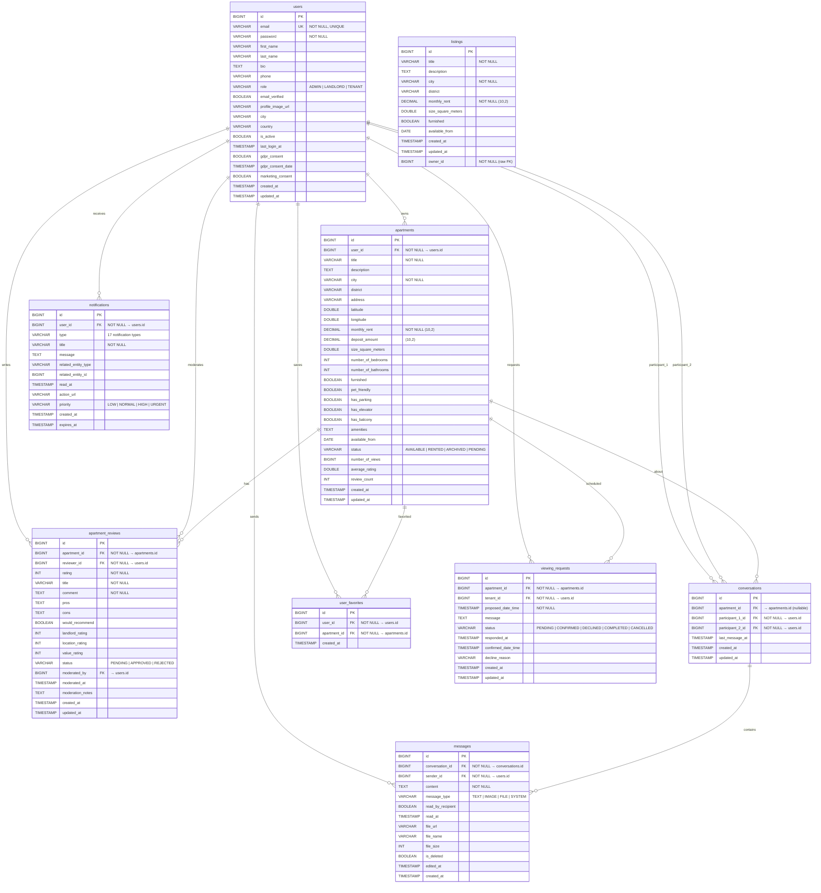

# SichrPlace — Entity-Relationship Diagram

> Render this file on GitHub or any Mermaid-compatible viewer.
> Each box = one database table. Lines show foreign-key relationships.

## Legend

| Symbol | Meaning |
|--------|---------|
| `PK` | Primary Key (auto-generated IDENTITY) |
| `FK` | Foreign Key |
| `UK` | Unique constraint |
| `||--o{` | One-to-Many relationship |
| `NOT NULL` | Required field |

## Table Count: 9

| Table | Purpose | Key Relationships |
|-------|---------|-------------------|
| `users` | User accounts with roles | Referenced by all other tables |
| `apartments` | Apartment listings | Owned by a user |
| `apartment_reviews` | Ratings and reviews | Links apartment + reviewer + moderator |
| `conversations` | Chat threads | Between two users, optionally about an apartment |
| `messages` | Individual chat messages | Belongs to conversation, sent by user |
| `notifications` | In-app notifications | Sent to a user |
| `user_favorites` | Saved/bookmarked apartments | Links user + apartment (unique pair) |
| `viewing_requests` | Appointment scheduling | Tenant requests viewing of apartment |
| `listings` | Legacy simplified listings | Raw owner_id, no FK relationship |
