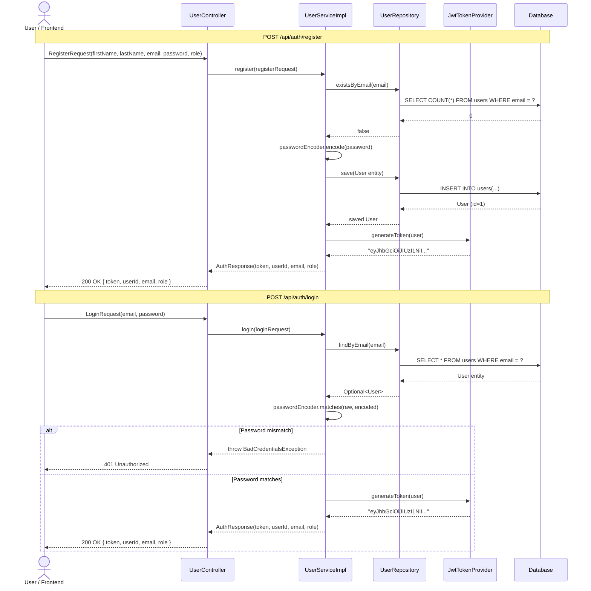
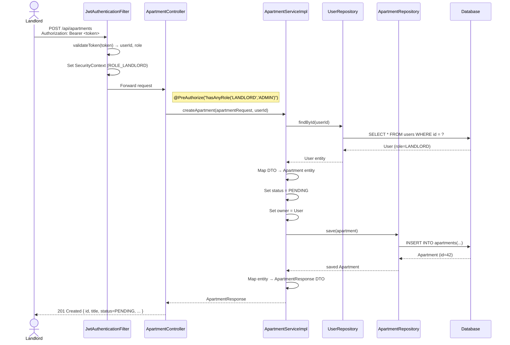
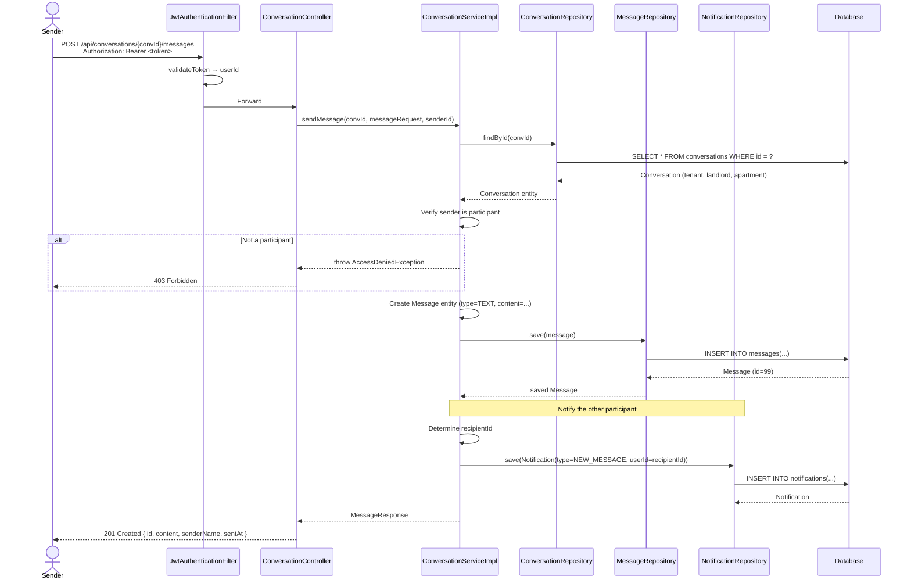
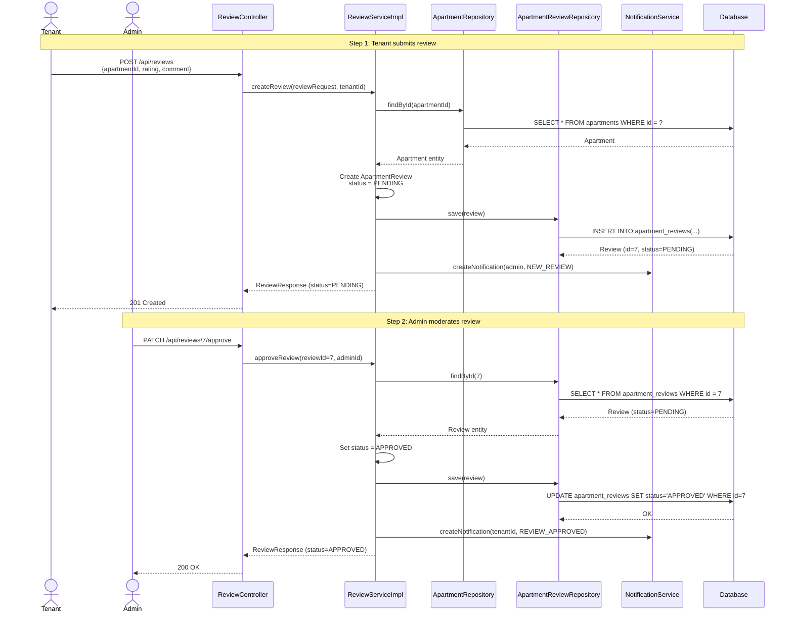
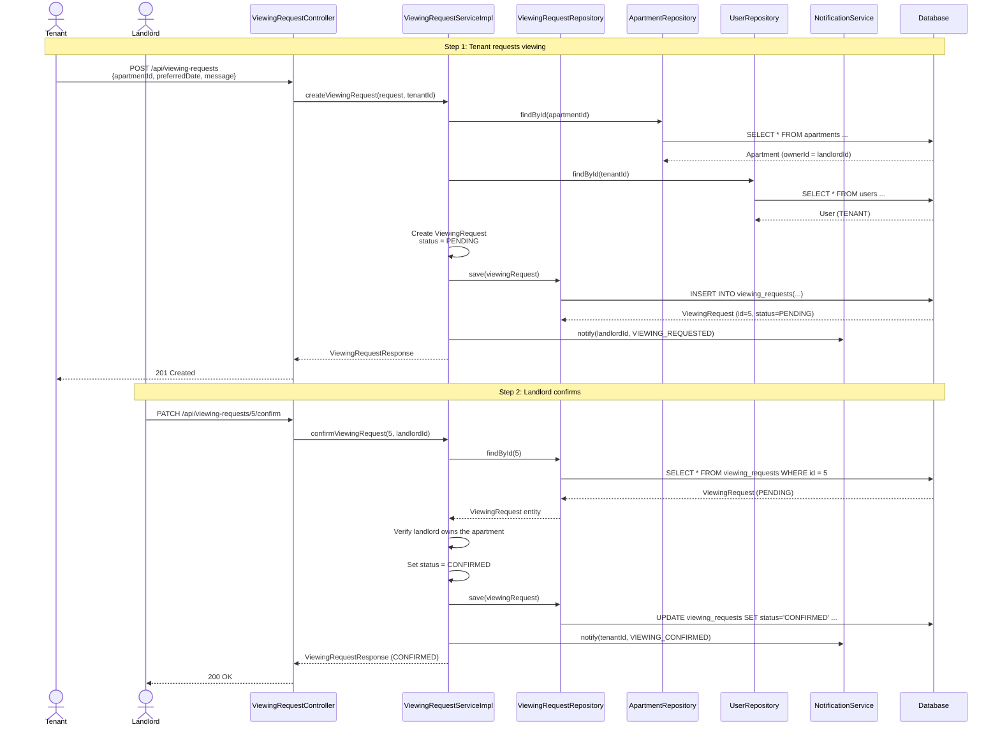
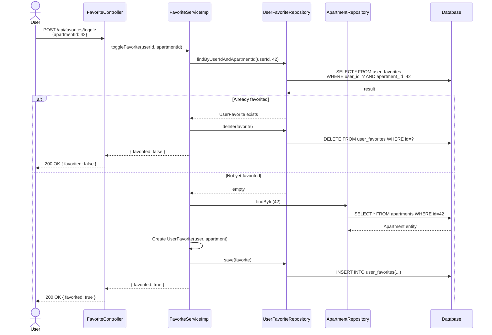
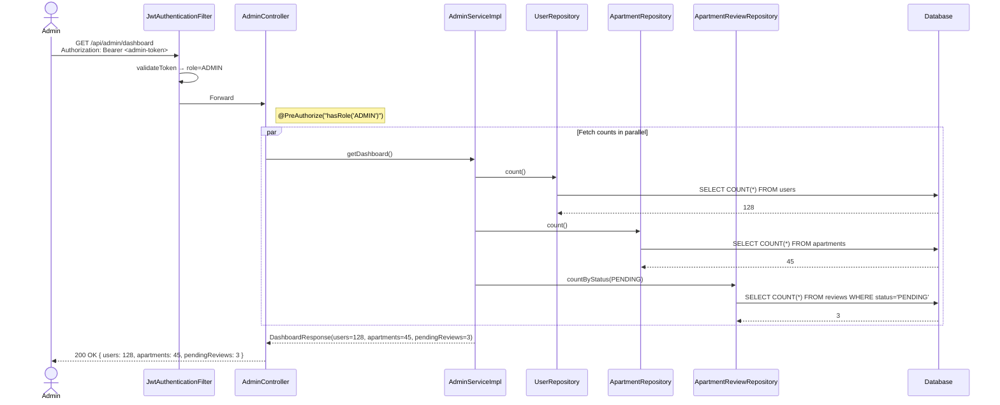

# SichrPlace — Sequence Diagrams

> Request-response sequences for the core user workflows.
> Each diagram maps directly to controller endpoints and service methods.

---

## 1. User Registration & Login

---

## 2. Create Apartment (Landlord)

---

## 3. Send Message in Conversation

---

## 4. Submit & Moderate Review

---

## 5. Request Apartment Viewing

---

## 6. Toggle Favorite Apartment

---

## 7. Admin Dashboard Flow

---

## Reading Guide for Students

| Diagram | Key Concepts Shown |
|---------|-------------------|
| **1. Register/Login** | DTO validation, password hashing, JWT generation, conditional flows |
| **2. Create Apartment** | Role-based @PreAuthorize, entity mapping, PENDING default state |
| **3. Send Message** | Participant verification, cross-entity notification side-effect |
| **4. Submit Review** | Two-phase workflow (submit → moderate), state transitions |
| **5. Viewing Request** | Multi-step lifecycle, ownership verification, notification pipeline |
| **6. Toggle Favorite** | Idempotent toggle pattern, existence check → create/delete |
| **7. Admin Dashboard** | Parallel aggregation queries, role gating |

> **Study tip:** Trace each sequence diagram back to the actual Java source code.
> Start with the controller method, follow the service call, and check
> which repository methods are invoked. The file paths are documented in
> [TUTORIUM_ROADMAP.md](../../TUTORIUM_ROADMAP.md).
