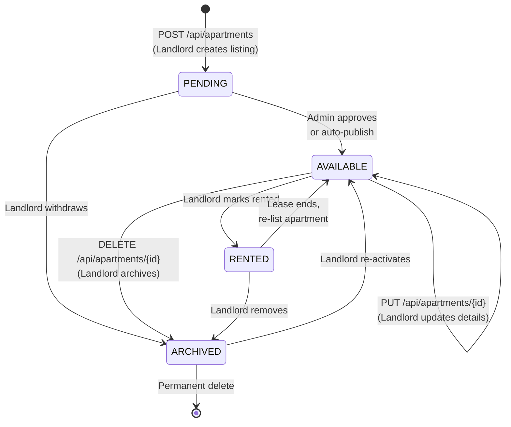
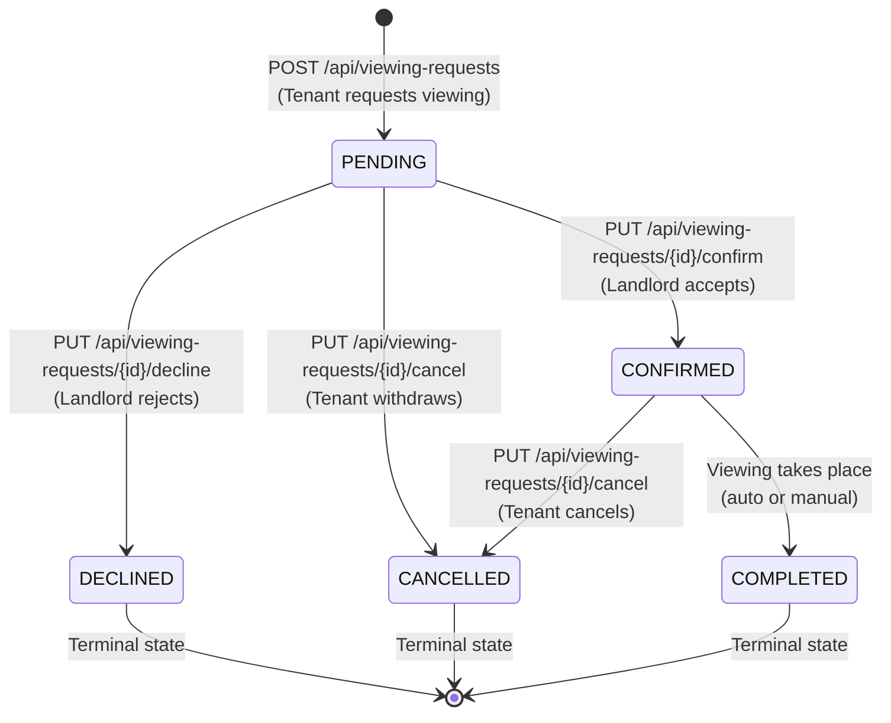
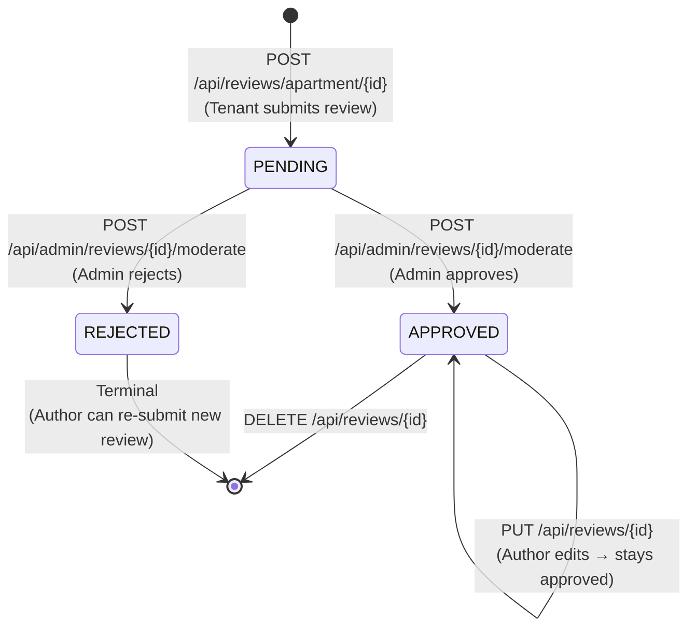
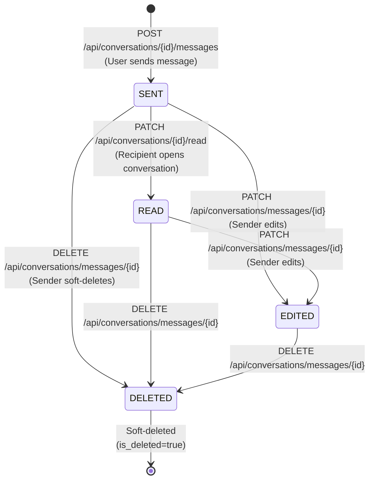
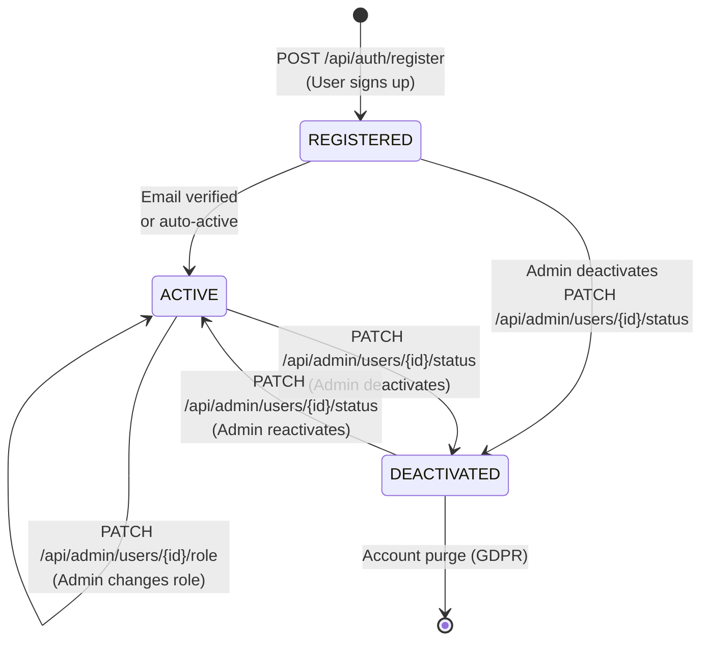
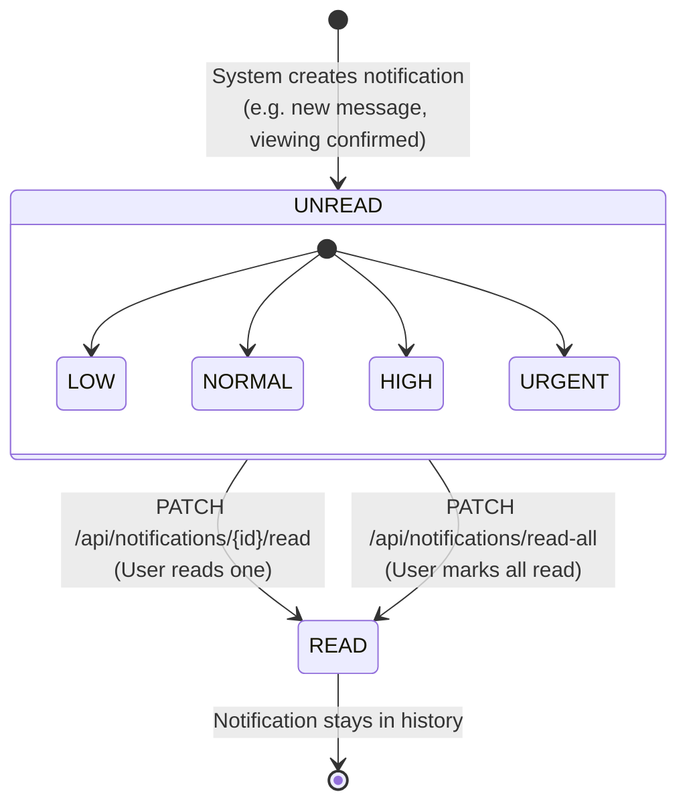

# SichrPlace — State Charts

> UML state machines for core domain workflows.
> Each diagram shows states, transitions, and which REST endpoints trigger them.

---

## 1. Apartment Lifecycle

### Apartment States

| State | Enum Value | Description |
|-------|-----------|-------------|
| **PENDING** | `ApartmentStatus.PENDING` | Just created, awaiting approval/publication |
| **AVAILABLE** | `ApartmentStatus.AVAILABLE` | Listed and visible to tenants |
| **RENTED** | `ApartmentStatus.RENTED` | Currently occupied, not available |
| **ARCHIVED** | `ApartmentStatus.ARCHIVED` | Removed from public listing |

---

## 2. Viewing Request Lifecycle

### Viewing Request States

| State | Enum Value | Triggered By | API Endpoint |
|-------|-----------|-------------|--------------|
| **PENDING** | `ViewingStatus.PENDING` | Tenant | `POST /api/viewing-requests` |
| **CONFIRMED** | `ViewingStatus.CONFIRMED` | Landlord | `PUT .../confirm` |
| **DECLINED** | `ViewingStatus.DECLINED` | Landlord | `PUT .../decline` |
| **CANCELLED** | `ViewingStatus.CANCELLED` | Tenant | `PUT .../cancel` |
| **COMPLETED** | `ViewingStatus.COMPLETED` | System/Landlord | After viewing date passes |

---

## 3. Review Moderation Lifecycle

### Review States

| State | Enum Value | Who Acts | Visible to Public? |
|-------|-----------|----------|-------------------|
| **PENDING** | `ReviewStatus.PENDING` | Author submits | No |
| **APPROVED** | `ReviewStatus.APPROVED` | Admin moderates | Yes |
| **REJECTED** | `ReviewStatus.REJECTED` | Admin moderates | No |

---

## 4. Message Lifecycle

### Message States (derived from fields, not an enum)

| State | Determined By | Description |
|-------|--------------|-------------|
| **SENT** | `readByRecipient=false, isDeleted=false` | Delivered but unread |
| **READ** | `readByRecipient=true, isDeleted=false` | Opened by recipient |
| **EDITED** | `editedAt IS NOT NULL, isDeleted=false` | Content modified after send |
| **DELETED** | `isDeleted=true` | Soft-deleted, hidden from UI |

---

## 5. User Account Lifecycle

### User States (derived from `isActive` field)

| State | `isActive` | `emailVerified` | Can Login? |
|-------|-----------|----------------|------------|
| **REGISTERED** | `true` | `false` | Yes (current impl) |
| **ACTIVE** | `true` | `true` | Yes |
| **DEACTIVATED** | `false` | any | No (403 Forbidden) |

---

## 6. Notification Priority & Read State

### Notification Types That Trigger Creation

| Event | NotificationType | Created By |
|-------|-----------------|------------|
| Tenant requests viewing | `VIEWING_REQUEST` | ViewingRequestService |
| Landlord confirms | `VIEWING_APPROVED` | ViewingRequestService |
| Landlord declines | `VIEWING_REJECTED` | ViewingRequestService |
| New message received | `NEW_MESSAGE` | ConversationService |
| Review submitted | `REVIEW_SUBMITTED` | ReviewService |
| Review moderated | `REVIEW_MODERATED` | AdminService |
| Favorite apartment updated | `FAVORITE_APARTMENT_UPDATED` | ApartmentService |
| System announcement | `SYSTEM_ANNOUNCEMENT` | AdminService |
